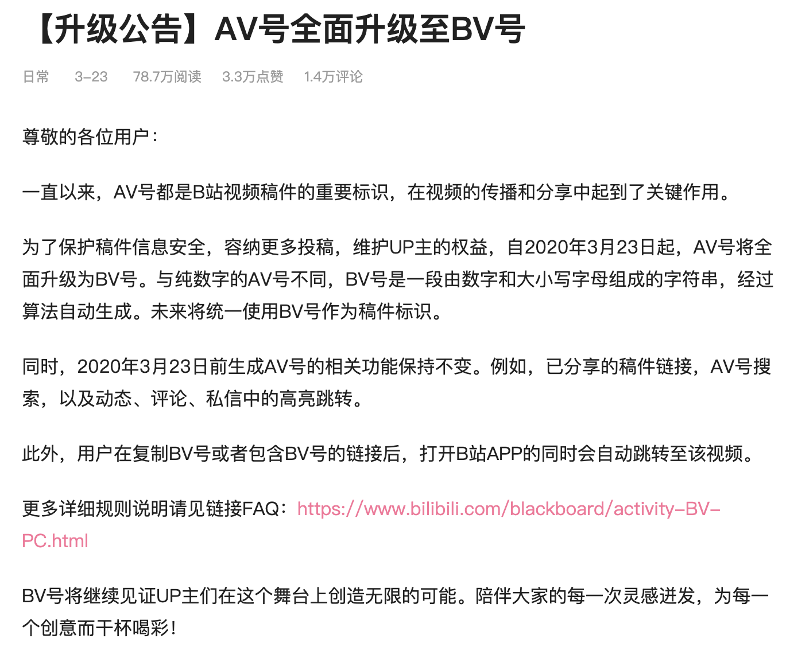
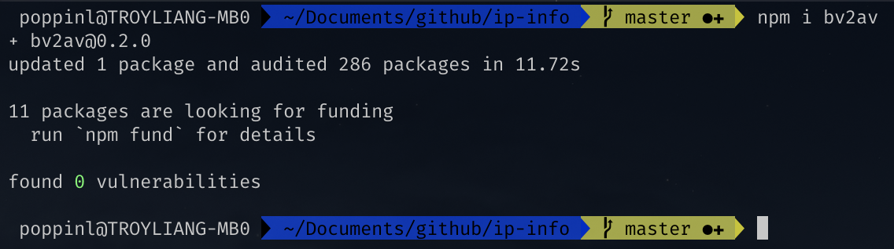
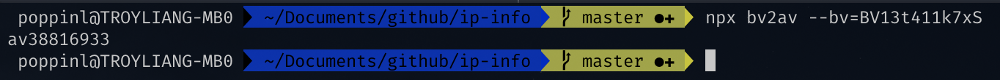

# 如何把 B 站的新 bv 号转回原来的 av 号

总所周知（并不），通过跨年晚会一炮而红的『小破站』Bilibili，昨天对视频的标识符号进行了升级。用新的 bv 号替代了之前的 av 号。官方的公告如下：

内容看起来一本正经的样子。不过坦白说，小猪并没有觉得这更加有利于传播和分享了。毕竟在 av 时代，我们可以通过在评论或者视频中标明 av 号，一串数字对于手动输入来说还是很容易的。而现在成了数字加字母（还区分大小写）的组合，手输难度爆炸上升呀。

那难道是因为 av 这个字眼有点怪怪的么...hmmmm...不过仔细想想，bv => boy v...咳咳，感觉还挺刺激的，哈哈哈哈（捂脸

不胡扯了，目测可能是因为技术相关的事情影响的吧。不过小猪也并不关心这个，小猪关心的是，有没有办法通过 bv 号转换出以前的 av 号。

## WHY

坦白说，想到这件事是因为小猪在其他社交平台插入新的 B 站视频的时候，那个平台提示视频链接不合法。王德发？确认了几遍我没有复制错以后，猜测应该是设置了一些 pattern，然后还没来得及适配 B 站的新 bv 号。

不过这只是一个出发点，更多的还是突发奇想的好奇，以及想让爷的青春结束的慢一点的情怀（老青结工了 doge

## HOW

小猪创建了一个 repo，提供了用于通过 bv 号转 av 号的 node 模块。

具体 repo 地址在[这里](https://github.com/poppinlp/bv2av)，欢迎吐槽，欢迎 star，欢迎 PR（时间真的是很仓促

用法很简单，如果你的电脑上有 nodejs 环境的话，只需要通过 npm 或者 yarn 来安装这个模块即可。例如：

然后我们就可以通过 nodejs 的代码来引入这个模块以供后续使用。关于这种方式这里就不展开啦，感兴趣的小伙伴可以自行去看看 repo 里的内容。

当然还有更简单的方式，可以直接通过这个模块自带的 CLI 来执行命令即可。例如：

什么？还是太复杂了？或者没有 nodejs 环境怎么办？别着急，小猪也准备好了网页端的使用方式。只需要打开这个链接 [https://poppinlp.com/bv2av/](https://poppinlp.com/bv2av/)，然后把 bv 号粘贴进去，再点击一下查询就可以啦。小猪是不是特别的贴心 嘤嘤嘤 >.<

## 后记

时间非常仓促，所以还没来得及优化样式，网页上的 JS 也直接原生直接撸了。身为一只前端攻城猪，实在有点愧疚...

不过 ts 那边的代码还是稍微清晰一点的，当然也很简单，感兴趣的小伙伴可以自行查看，相信很容易就能看明白。

最后，作为一枚透明小粉丝 + 透明小 UP 主，希望『小破站』越来越好！（震声

## 相关链接

- [在线使用地址](https://poppinlp.com/bv2av/)
- [bv2av repo](https://github.com/poppinlp/bv2av)
- [我的 segmentfault 专栏](https://segmentfault.com/blog/zxzfbz)
- [我的知乎专栏](https://zhuanlan.zhihu.com/zxzfbz)
