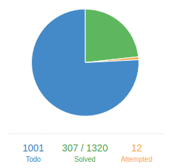
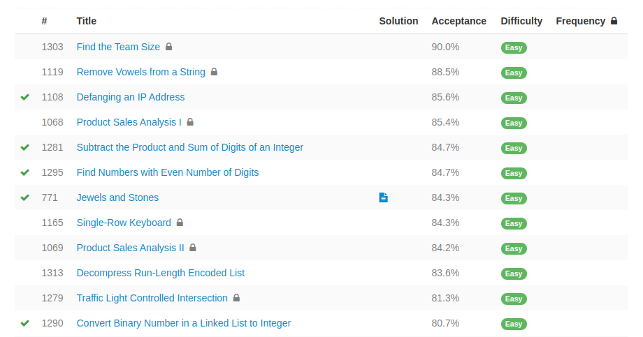
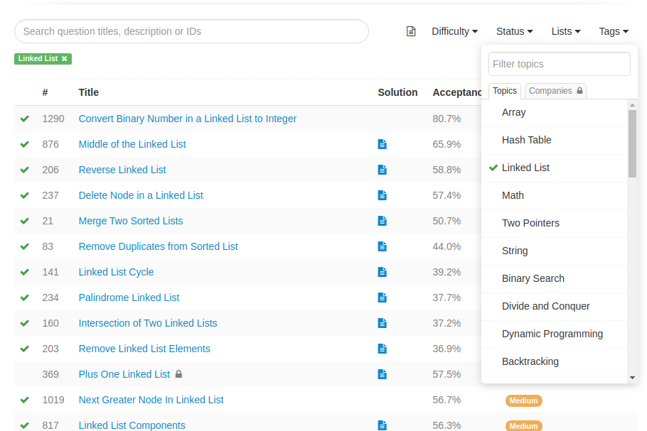
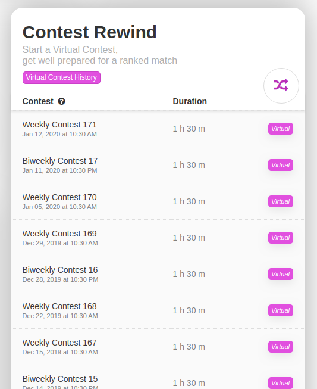
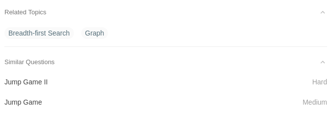
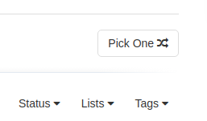
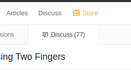

萌新刷题 UP 主张小猪前来报道。

因为比较懒，所以战绩比较差，目前才 307/1320。可是我萌鸭，所以不接受大佬们鄙视的目光，哼 >.<

坦白说，一上来看到一共有 1000+ 题目数量，我是懵逼的，也是拒绝的。后来试了试第一题，Two Sum，卧槽，这么简单，我又可以了。直到卡在了某一道题目，顿时有种累觉不爱的体验，感觉身体被掏空...

后来经历了蛮长的一段时间，断断续续的重启、不爱、重启、不爱。似乎又回到了初中初恋的样子，拿着一片树叶，我可以、我不行、我又可以了、我又不行了...

这里分享一下我尝试过的一些方式吧，大佬们我就不管啦，萌新们可以放心食用鸭。

### 1. EASY COME EASY GO

- 推荐人群：萌新
- 适合场景：找自信
- 获取方式：进入[所有题目](https://leetcode.com/problemset/all/)后点击 Difficulty 从 Easy 开始排序

首先介绍的就是这种可能会深受萌新喜爱的方式，即难度从 Easy 到 Hard 的排列。看看这通过率，多可爱；再看看这绿色，多和谐。这种方式我觉得非常适合刚开始刷题的小伙伴，因为对于萌新来说，可能 CS 基础并没有那么好，又或者是套路没有那么熟练。题的总量就已经够劝退的了，再被轻易卡死的话，简直就是一种摧残呀，很容易就让人丧失了斗志或者兴趣。从而早早的结束掉好不容易开始的刷题之旅。不要问我是怎么知道的，哼 T_T

毕竟我们不是在玩黑暗之魂，这也不是宫崎老贼的题库。所以我们理应对于本来就处于尝试阶段的自己，建立信心和兴趣。这样才能长远的走下去嘛。而且，千万不要觉得只做 Easy 比较丢脸！千万不要！Easy 怎么了，那也是题库的题，宝宝就是喜欢 Easy，你咬我鸭，略略略 >.<

不过话说回来，要是度过了找自信这个阶段的话，还是不推荐继续这样刷。毕竟确实整体难度不大，而且这样做题也不系统。对于自身没有办法持续性的提高。

### 2. 专题和分类

- 推荐人群：所有人
- 适合场景：学习的陪练、集中攻坚、面试准备
- 获取方式：进入[所有题目](https://leetcode.com/problemset/all/)后点击 Tags 即可看到分类，右侧也有其他专题

这种方式对于具体的分类的集中训练还是蛮有效果的。可以作为当我们在学习某一块内容时候的陪练题；也可以作为复习和深入某个话题的集中训练；另外当你需要为一些主要考算法的公司做面试准备的时候也是很有效果的。

它的优势在于，第一，我们可以体会到围绕着这个分类的不同变形，这样有利于我们更快更准确的识别题目是否是可以用这类思想来解决。第二，由 Easy 到 Hard 的各种题目，可以让我们逐渐感受到这个分类在解决问题思路上的深入和改变。第三，集中式的练习可以有效的强化我们的思维方式，并且可以从中尝试找到一些规律和方法，以后再遇到类似的问题可能会有直接的思路。第四，有些分类可能会有固定的套路和模板，这样的集中训练可能会更容易的发现这些套路和模板。

当然，它也有自己的劣势。这种方式可能进度会比较慢，例如可能会对一种类型很熟了，但是对其他类型还是不熟悉。所以可能并不适合短期内期望自己有整体广泛的提高的状况。

### 3. 周赛

- 推荐人群：所有人
- 适合场景：闲暇时间的兴趣爱好
- 获取方式：进入[比赛列表页面](https://leetcode.com/contest/)即可看到往期比赛

这种方式不会占用太长的时间，题目内容也比较分散，比较适合闲情逸致的时候做几道陶冶情操。什么，你说没有人会有闲情逸致来做题？哼，小猪本猪现在就是这样哒，才不是因为我懒所以不想持续做题呢 >.<

优势在于，第一，它新呀，每周都是新题，就像买了新的口红一样，多开心。第二，有目标点和成就感，一次比赛就 4 道题，打完收工。第三，它并不会占用长时间和大块时间，也不需要特别的准备和总结。第四，调整空间比较大，可以只是平时写写，没有压力；也可以想紧张和挑战，在比赛时间去测试一下自己。并且目前 leetcode 也有周赛和双周赛，适应不同的时间节奏。

劣势在于，不存在的，小猪用的方式怎么可能有劣势呢，哈哈哈哈，有也不告诉你，别人说我也不承认，哼 >.<

### 4. 联想

- 推荐人群：所有人
- 适合场景：对题目或者类型的变形感兴趣
- 获取方式：大多数题目详情下面都有 Related Topics 和 Similar Questions 栏

这种方式也是本小猪很喜欢的一种方式，其中 Related Topics 是这道题相关的多个话题，而 Similar Questions 则是题目的变形或者进阶，所以常常看见 xxx I、xxx II、xxx III 之类的名字。

优势，顺藤摸瓜的找到这道题的变形和进阶，逐渐提高对于这个问题的思考方式，甚至做多了也能想到一些题目应该如何变形。从而能更好的掌握相关类型的思考方式，以及应对变化的能力。

劣势，有些题目没有 Similar Questions。蓝瘦 T_T

### 5. 随机，任性

- 推荐人群：大佬，任性
- 适合场景：发挥大佬的优势，碾压一切题目
- 获取方式：所有题目列表处有 Pick One 按钮，每道题的下面也有 Pick One（好想说我第一次看成了 PG One）

这种方式同样不会占用太长时间，认真讲的话使用场景也是闲暇时间刷刷题娱乐吧。不过相对于专题而言没有那么有针对性，相对于周赛而言又没有目标和成就感。所以特别适合任性的大佬们秀技术碾压。

不过，有一说一，这个 Pick One 的时候，有种莫名的翻牌子的爽快感，哈哈哈哈。为了这个感觉，本小猪也硬是这样刷了小一百。

### 6. 云刷题

- 推荐人群：忙的小伙伴，大佬
- 适合场景：想方法，看思路，节约时间
- 获取方式：看题解、看题目的 Discuss 板块

这种方式比较适合有一定基础的大佬们，也就是一旦有了基本的思路，实现代码轻轻松松。那么为了节约时间的话，可以直接看看题目描述，然后想想思路即可。脑补出代码后，大概考虑好时间复杂度和空间复杂度，然后再看看 Discuss 板块里有没有其他有意思的实现思路或者更好的优化方式。

优势在于确实很节约时间，也可以根据兴趣看一些想看的题目。不过缺点也是对应的，需要一定的自信和实现能力。

------

总结一下，上面讲到了几种思路和推荐人群、场景。希望能对还没开始的小伙伴们有帮助。毕竟我这是亲身实验过的鸭，连我放弃了很多次这种丢脸的事都说出来了，大..大佬们可不可以不要嫌弃我（泪光

不过如果想认真刷题的话，还是需要耐心和持久的。集中攻坚 -- 耐心，休闲娱乐 -- 持久。并且我一直觉得，如果是为了应付面试，那么为了刷题而刷题是 OK 的。如果是为了 CS 基础，那么其实就没有必要为刷而刷了。还有大量的其他基础内容需要学习和探索呢，工程上也有大量的东西等待去实践呢。如果能把刷题和这些结合起来，最终应用起来，那你就是小猪的偶像，嘿嘿。

最后，咳咳，到了广而告知的时间啦。小猪开始写文章啦！（撒花）目前是最近几期周赛的全部题解，后续会继续扩展一些算法、数据结构的内容，当然还有我本职工作前端的内容。特点，通俗易懂，思路、优化都很详细，并且性能 beats 90% 以上。下面是几个专栏和公众号，欢迎小伙伴们来骚扰鸭。小猪在这里先行阿里嘎多。（都是重点，划下来，要考的 >.<）

- [segmentfault专栏](https://segmentfault.com/blog/zxzfbz)
- [知乎专栏](https://zhuanlan.zhihu.com/zxzfbz)

