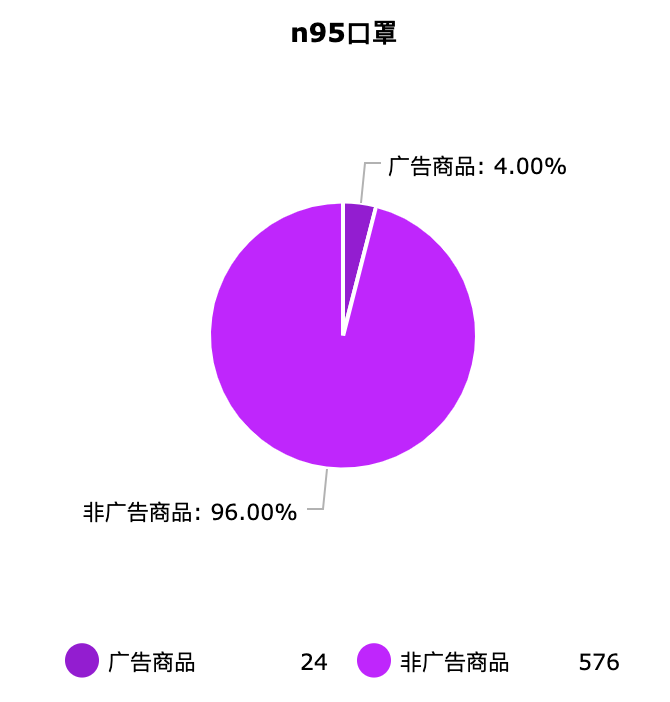
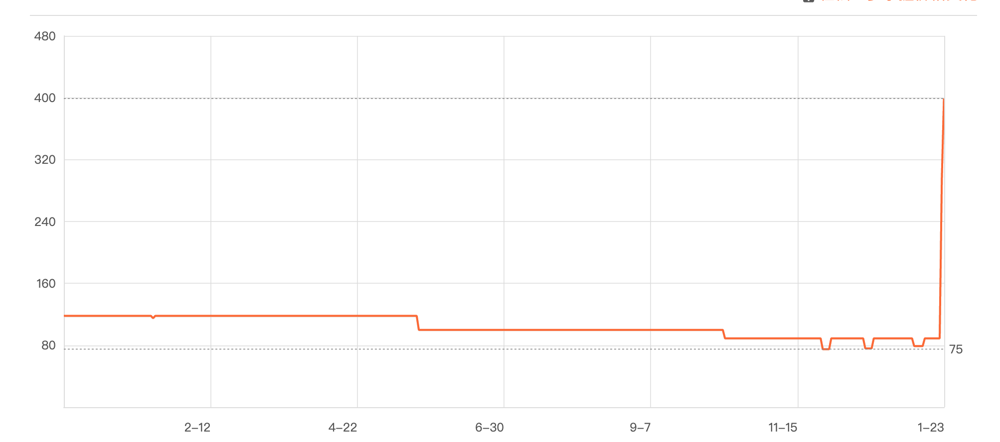
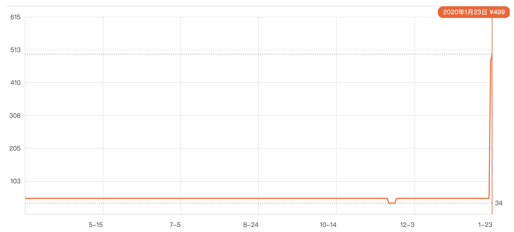
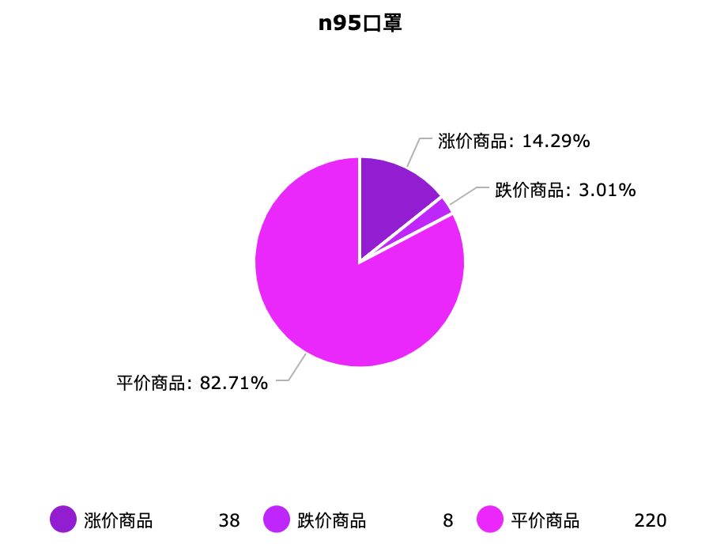
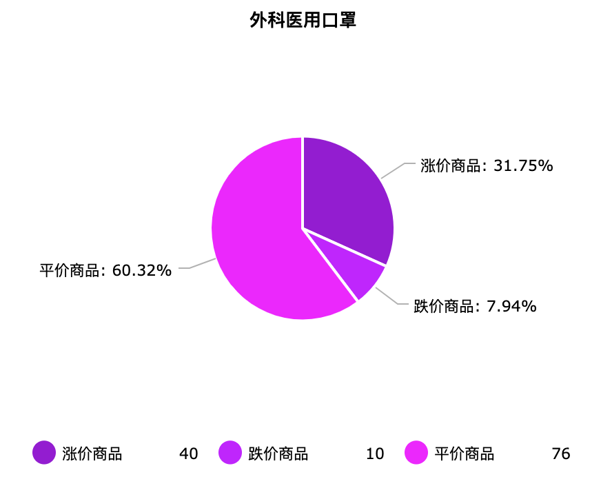
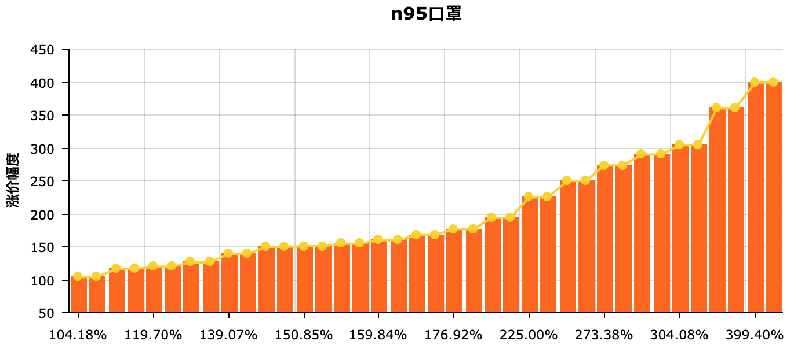
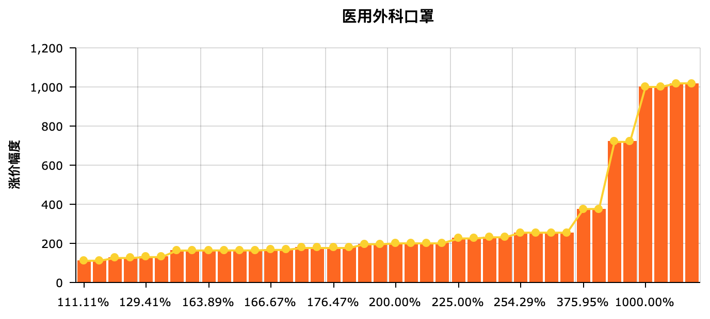
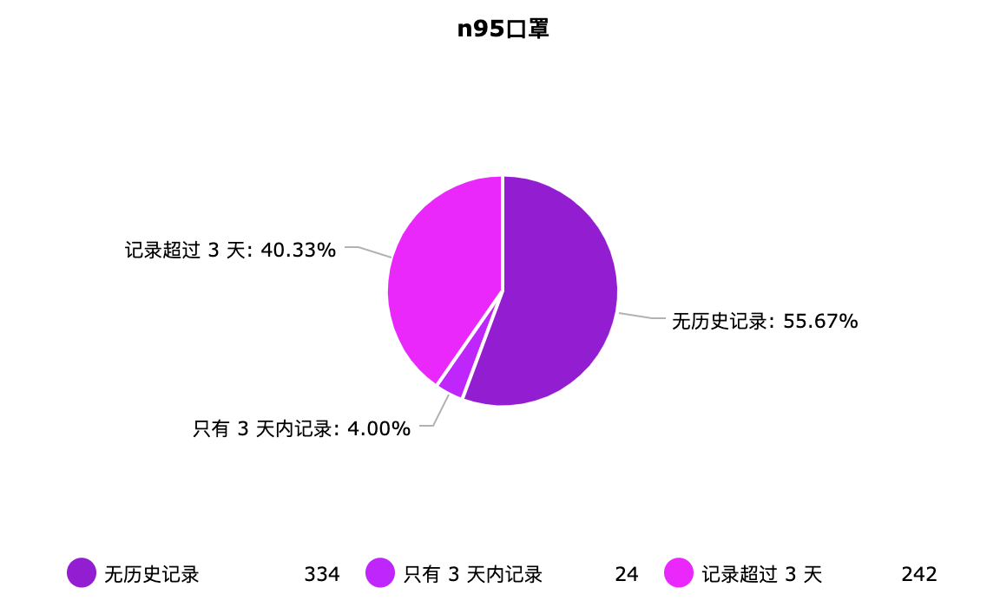
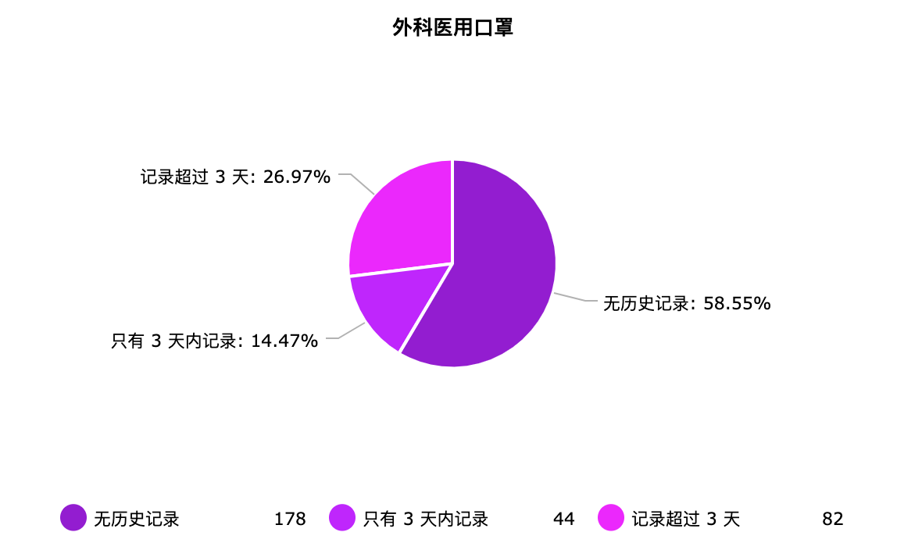
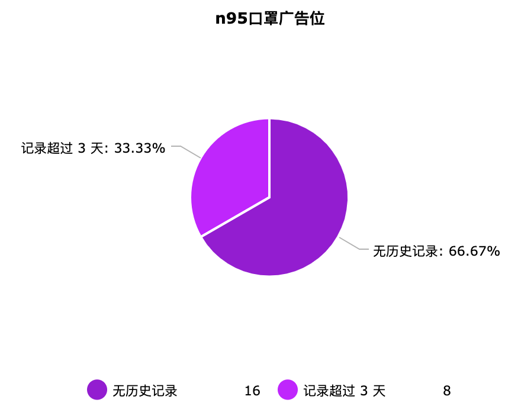

# 从电商数据看现在口罩价格到底如何

Hi 大家好，我是张小猪。今天小猪不做 leetcode 题解啦，而是把视线放在一件最近很让人揪心的事情，那就是新型冠状病毒。

## 背景

小猪不是生物学生或者医学生，所以对于病毒本身的分析或者相关 paper 阅读真是无能为力。不过相信小伙伴们也从其他渠道了解到很多相关的信息了。小猪会注意到这个事情，是因为自己最近两天看一些社交平台和朋友圈，一直被这个东西刷屏，那就是...口罩！口罩！口罩！

由于被官方钦点了是一种有效的防御病毒的手段，这种平时相对少见的东西一下子成了各种公共场合的必需品。相应的，『医用外科口罩』和『n95口罩』也就一下子成了风靡一时的词语。随之而来的，便是线上和线下的抢购风潮。于是乎在一些社交平台逐渐出现了各种关于口罩价格疯涨的评论，以及各式各样的截图和吐槽。小猪个人对于这种发国难财的行为不想做过多评论，所以也没太上心。

再发展到今天（22号），小猪看到了各大电商平台官方发文，大体都是关于「启动补贴，禁止涨价，违者下架」这些内容展开的。小猪自己其实对于这些电商平台的官方行为还是蛮感动的。不过转念一想，非常好奇现在真实的状况究竟如何。那就来找找数据看看吧。

## 获取数据

按照以往惯例，这里应该会出现一个单词 Python。然而小猪偏不，小猪就要用 JS，哼（才不是因为小猪不会写 Python 呢...

那么先看看大体思路吧：（以下凡是涉及到关于平台自身信息的部分，不会说的太详细）

1. 确定关键字。
2. 找到目标电商平台的 API。
3. 根据关键字拉取列表数据。
4. 找到第三方比价平台的 API。
5. 根据商品信息去查询历史价格。
6. 对比和分析。

关键字这里小猪并没有想太多，直接就用了『医用外科口罩』和『n95口罩』。关于电商平台，小猪根据个人爱好把视角锁定在了某知名电商平台，也是官方发文了要控制口罩价格的平台之一。首先去看了一下请求，发现该平台的商品搜索列表还是很容易能拿到的。不过由于做了 SSR，所以其实拿到的是一段 HTML 代码。这里自己写 parser 有点太没必要了，所以小猪直接用了开源的 lib 进行 parse。

这里推荐几个我以前用过觉得还不错的 lib 吧，分别是 jsdom、cheerio 和 htmlparser2。这三者如果单纯从 parse html 的性能来看，顺序应该是 htmlparser2 > cheerio > jsdom。不过由于 htmlparser2 其实只是一个单纯的 parser，所以比另外两者快也是很正常的。另外两者在 parse 的基础上，增加了很多外围的功能补充，例如一些选择器和 dom 操作等。从它们扩展的接口和功能来看，顺序应该是 jsdom > cheerio > htmlparser2。所以具体场景下要使用哪一个，小伙伴们就自行取舍啦。我这里是自己写了几个特定的类似于 `querySelector` 的 helper，然后就直接用了 htmlparser2 来进行单纯快速的 parse。

当我们处理完以上数据之后，便能得到一个基于关键字的商品列表了。记下来小猪又把视角看到了一个自己常用的第三方比价平台，同样去看了看请求，发现还是很容易拿到的。不过其中有一个特殊的 token 看起来比较棘手，因为小猪翻了很久各种请求和 response 内容，都没有发现这一串 token 的来源。最后无奈的只能使用我的魔法咒语了，『巴拉巴拉 张小猪是最棒(pang)哒』，然后我就惊异的发现这个 token 竟然是前端生成的。hmmm...有点意思。并且更有意思的是，为了让这一点不那么容易被识破，这里前端 encrypt 过程使用的代码经过了特殊的混淆。一眼望去，满脸懵逼；二眼望去，更加懵逼。可是，小猪本来就是笨笨的鸭，所以就正好被我发现了如何使用。于是最后就愉快的自己生成 token 啦。不是猪年还这么幸运，嘿嘿嘿 >.<

以上步骤都测试完以后，小猪把它们封装成了一些简单的 job，然后根据命令行参数去获取关键字和页面数量。这时候又怕请求太频繁会被 ban IP，于是特意让一个个 promise 又串行又 delay。为了 20 页的数据愣是等了一小会才跑完，趁机去偷吃了一点零食，嘿嘿嘿，是不会长胖的零食哟。

## 分析数据

终于到了这个激动人心的时刻啦，接下来就打算看看得到的一堆 JSON 数据里有没有什么有意思的信息。例如有没有商家疯狂涨价却没有被下架呀，哈哈哈，小猪真是太坏啦。这里还是再说一下这次收集的商品列表，是来自某知名电商平台的『医用外科口罩』和『n95口罩』这两个关键字，搜索结果的前 20 页。那么接下里我们一起来康康吧。

首先是一个意外发现。在分析数据的过程中，小猪才第一次知道自己平时常用的这个知名电商平台，在搜索结果列表里其实是有广告的。并且不是对外的广告，是一些店铺的商品，看起来就和其他搜索结果一样，除了两个很不引人注目的小字『广告』。盲猜也是关键字竞价排名吧，不过这不是今天的重点，所以管他呢，开心就好。以下是收集到的数据中广告的占比，大概能看出这个平台对于这种混淆性很强的广告还是很克制的：

接下来小猪把重点放在了商品的当前价格和历史价格的对比上。由于历史价格可能有一些因为活动导致的浮动，所以取了中位数。而当前价格，本来小猪想用最近 5 天的最高价格的，不过想想觉得太坏了，响应号召、知错就改是值得鼓励的，所以就还是只用了最新价格。不过结果还是蛮刺激的，两个关键字的商品搜索结果里，当前价格对比历史价格中位数的最大涨价幅度分别达到了 400% 和 1000%。感觉有点刺激呀。什么？你不相信？我从结果里找了两个例子供小伙伴们感受一下：

那么是否有反其道而行之的良心商家呢，例如价格反而比历史中位数更低的。当然是有的啦，更甚者有当前价格对比历史中位价达到了 5 折的呢。不过小猪去看了一下，也不是最近一两天降的价。不过还是为不涨价而点赞吧。总的价格情况如下图：

从比例来看，情况似乎没有在社交平台看到的那么糟糕，可能是电商平台的公告确实起到了一定的作用吧。虽然还是有部分涨价商品，并且其中部分涨价幅度还是挺大的。不过超过半数的仍旧还是维持住了价格。小猪个人对于大幅涨价行为不做过多评价，所以这里也不会给出商家和商品信息。

到这一步后，小猪本来觉得似乎都还挺正常，准备对商家们点赞。不过无意中回看了一下上面n95口罩的数据，平价商品 + 涨价商品 + 跌价商品为什么一共才 266 个，我不是取了 600 个商品么。难道小猪穿越了？摸摸猪鼻子，感觉事情并不简单。

重新回看之前的数据，小猪发现了一个很有意思的事情。有大量商品是新上线的商品，根本没有历史数据，所以自然不属于价格变动的范围。并且也有少部分商品它们的历史价格记录只有最近的一两天，也就是电商平台官方公告之前刚刚上架不久。它们的比例如下图：

从统计结果来看，搜索结果前 20 页的商品里，无历史价格记录的商品占了一半以上，结合只有 3 天内历史价格的商品，总和分别达到了 60% 和 72%。并且，单看广告位的那些商品，无历史价格记录的达到了 2/3。那么为什么会一下子蜂拥出这么多新上架的商品呢？而且时间点还是这么巧合的在各大电商平台发文要求口罩不能涨价，否则下架的背景下。

## 总结

以上只是基于某知名电商平台的搜索前 20 页商品的简单数据分析，结果似乎有点耐人寻味。从好的角度出发，可能是出现了这样的病情后商家们主动上架和提供了更多的相关商品。从坏的角度出发，也可能是为了绕过电商平台的涨价监控。具体的话相信小伙伴们也会有自己的想法。

这里并不打算给出具体的商家和商品数据，因为小猪也并不是针对他们。只是想根据真实的数据来看看电商平台的相关公告，以及口罩目前的具体价格情况而已。代码还在小猪的本地 repo，就先放个图吧。如果有小伙伴需要的话，后续小猪也整理一下把代码放到 github。[这是小猪的 github profile](https://github.com/poppinlp)，可以关注防迷路哟。

## 后记

写完文章的第二天早上一醒来，发现武汉被封城了。哎，感到莫名的难过。加油武汉，天佑中华！

## 相关链接

- [我的 segmentfault 专栏](https://segmentfault.com/blog/zxzfbz)
- [我的知乎专栏](https://zhuanlan.zhihu.com/zxzfbz)

