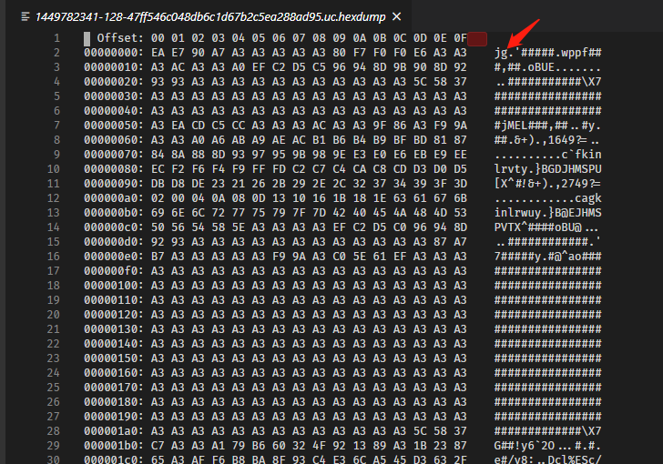
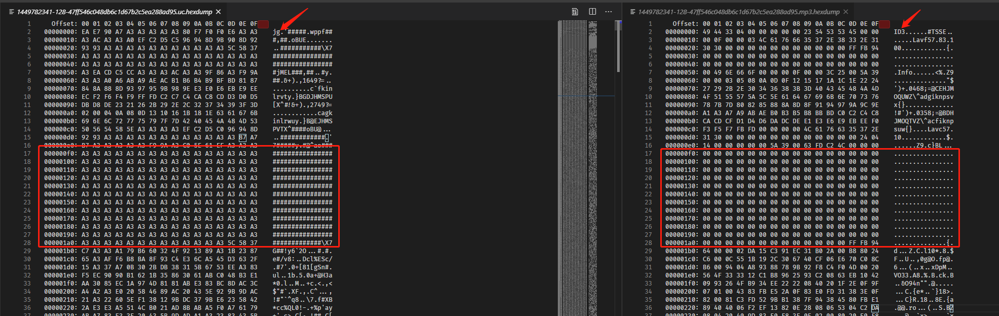
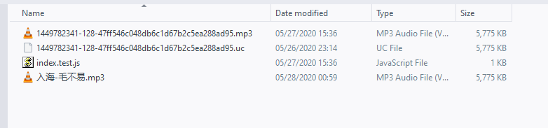
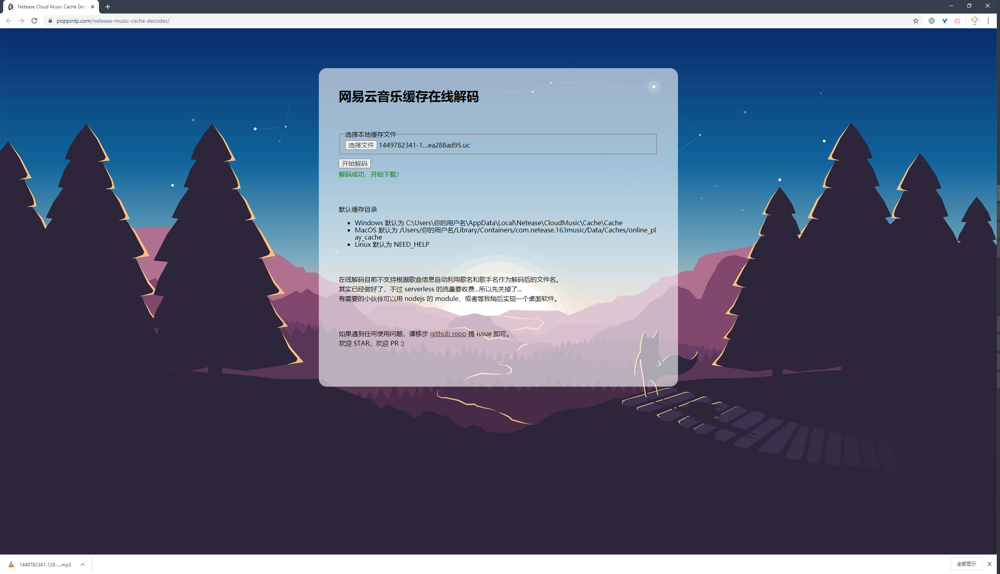

# 如何从缓存白嫖网易云音乐

> 本文仅供学习和交流！

一切的起因都得从一个神秘的夜开始...

那天小猪在剪视频的时候，突然想用几首曲子作为 BGM，于是兴高采烈的想到了钟爱的网易云音乐。不过在小猪的印象中，很多年前，是可以通过直接修改缓存文件的后缀名来白嫖音乐下载的。于是一个邪恶的计划就此展开...

## 后缀名？

首先我们来到网易云音乐在本地的缓存目录，当然肯定是一堆看起来奇奇怪怪的文件啦。


按照体积来看，这些 `.uc` 的文件应该就是 mp3 了。于是按照老方法，直接用播放器打开试试，结果发现无法正确解码。可达鸭眉头一皱，发现事情并不简单。看起来，这些缓存文件应该是经过了处理的。不过既然作为本地缓存使用，那么这个处理一定是可逆的，并且通常是不复杂的。我们就尝试来找找线索吧。

## 选个姿势

首先就是，通常来说各种不同的文件类型都会有自己特定的格式。上网搜寻一番之后发现，mp3 文件开头会都会有一个以 ID3 开始的标签头。于是抱着好奇心，我们来查看一下这个 `.uc` 缓存文件看看：



可以发现并不符合之前查到的格式。因吹斯汀~

结合我们前面说的，这个处理一定可逆，并且可能不会很复杂。小猪这里大胆猜测可能是对于每一个 byte 都进行了某种运算。接下来我们对比一下正式下载下来的 mp3 和这个缓存文件的内容：



图中左侧为缓存文件的内容，右侧为对应的 mp3 文件的内容。可以发现右侧数据确实是以 ID3 开头的，验证了之前搜索的内容。这里其实我们就得到了一个由原始数据到处理后数据的对应表。可以作为后续解码的线索。

不过其实更让小猪注意的是，我们在 mp3 文件中会发现存在着一段 00 的内容，可能是作为头部扩展标签的预留位。不过在缓存文件中，这部分内容全部变成了 A3。由于 00 这个值的特殊性（全都是 0 鸭），小猪下意识觉得这里很可能就是一个突破口。

首先，根据这段数据的位置关系，我们可以猜测的是处理后的缓存文件中每个 byte 都是原地修改数据，并不存在数据整体的前后移动。接下来，如何从 00 变为 A3 呢？这里可能有几种很常见的运算，例如通过加法、或运算或者异或运算。假设是通过加法，那么在编码和解码的时候还得处理数据溢出然后循环的问题；假设是通过或运算，那么解码的时候就无法直接还原了，毕竟 0 | 1 与 1 | 1 都是 1；假设是通过异或，那么还原只需要再做一次异或运算即可。看起来似乎得到一点线索了，我们再验证一下吧。

基于上面的线索，我们回头看看标签头部的值，缓存文件中是 EA、E7、90，mp3 文件中是 49、44、33。下面就是见证奇迹的时刻啦：

```js
(0xea ^ 0xa3) === 0x49
(0xe7 ^ 0xa3) === 0x44
(0x90 ^ 0xa3) === 0x33
```

感兴趣的同学可以自行尝试算一下上面 3 个判断，会发现它们全都是 `true`。亦可赛艇！

到此似乎线索已经明朗起来了，那么我们尝试把整个文件都转换一下吧。

## NodeJS 模块

在 NodeJS 中我们可以轻松的把文件的内容读进内存，然后对每一个 byte 进行上述运算处理，再将结果输出。常见的方式有两种，可以基于 `fs.open` 去创建文件句柄，或者基于 `fs.createReadStream` 来创建读取流。对于大文件来说，后者会比较有优势，不过对于常见的 mp3 歌曲，小伙伴们可以看自己的喜好咯。

这里小猪实现了一个 repo 包含了上述功能，repo 地址[在此](https://github.com/poppinlp/netease-music-cache-decoder)。当然除了直接解码 buffer 或者解码文件之外，还支持通过缓存文件名自动获取这首歌的歌名和歌手来作为解码后输出的文件名。例如 repo 中的测试文件的结果如下：



repo 中的代码并不复杂，暴露的方法也很简单，感兴趣的小伙伴可以自行查看。欢迎 STAR，欢迎 PR~ >.<

## 在线版本

了解小猪的小伙伴一定猜到啦，除了 NodeJS 模块，小猪也提供了在线版本供使用。具体地址[在此](http://poppinlp.com/netease-music-cache-decoder/)。

该在线版本可以选择本地缓存文件，然后进行在线解码，处理完之后自动触发下载。效果如下图所示：



不过在线版本目前不支持自动获取歌名和歌手名。其实云服务的 serverless 那边已经做好接口了，但是小猪测试的时候发现外网流量要计费，100 首歌就几百兆啦。小猪最近经济又比较拮据，所以决定先不支持啦。如果需要的小伙伴多的话，可以等等小猪后续的桌面软件版本。

## 后记

最终的代码其实非常简单，不过中间寻找线索的过程还是挺有意思的。所以写出来和小伙伴们分享一下。但是有很多环境还没有测试过，例如 macOS、linux、android、iOS 等平台的缓存默认路径啦，或者不同平台的浏览器的兼容性啦。如果发现有问题，欢迎去 repo 中提 issue 即可。

加之最近发现 electron 已经发布了 9.0.0 了，而小猪以前用它来做正式项目的时候还是很多年前的版本，于是想体验一下现在究竟有哪些改变。所以就打算顺便做一个桌面软件版本。

当然本文也是有时效性的，如果网易云音乐改了缓存文件的编码方式，那么可能就失效啦。不过到时候小猪应该也会更新 repo 的代码的。

> 本文仅供学习和交流！

## 相关链接

- [在线使用地址](https://poppinlp.com/netease-music-cache-decoder/)
- [netease-music-cache-decoder repo](https://github.com/poppinlp/netease-music-cache-decoder)
- [我的 segmentfault 专栏](https://segmentfault.com/blog/zxzfbz)
- [我的知乎专栏](https://zhuanlan.zhihu.com/zxzfbz)

