# 小猪的 win10 桌面重生记

Hi 大家好，我是张小猪。不务正业了一段时间之后，小猪又回来啦。

不过在出 leetcode 周赛题解之前，小猪在一个月不黑风不高的夜晚，听着喜欢的《アゲイン》的时候，突然一下子觉得，我这个默认的 windows10 的桌面也太丑了 8。~~一点都不配小猪的颜值~~ 于是决心稍微优化一下。

不过，自己慢慢做主题是不可能做的，这辈子不可能做的。但是网上那些社区就不同啦，进了里面去，个个都是人才，说话又好听，超喜欢在里面的感觉~

这里我就先分享一下我调教的成品吧：（为了把 gif 弄到 4M 以内又不是太糊，尽力了）

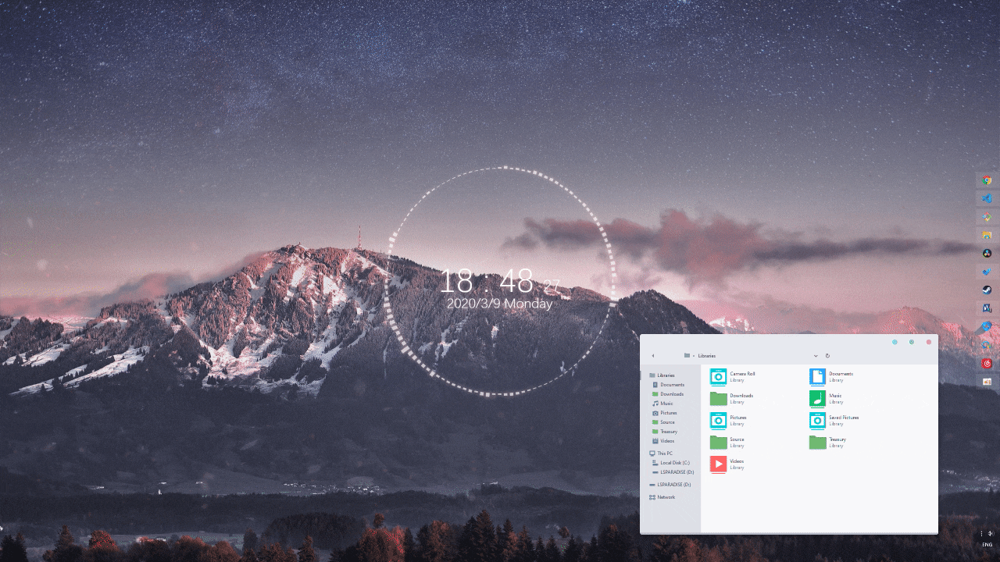

## 如何实现

下面就来说一下详细的调教过程吧，不过都是一些第三方的工具，并没有哪个工具是我自己写的。如有侵权，小猪挥刀自删。

### UltraUXThemePatcher

首先是一步非常重要的前戏，这一步直接影响了后续步骤的顺利与否。

这是一款由 SpartanCoders 开发的用于方便自定义 windows 主题的工具。我使用的是 3.7.1 这个版本。安装过程中没有什么需要设置的东西，不过最开始的时候可能会弹出一个发布商警告。

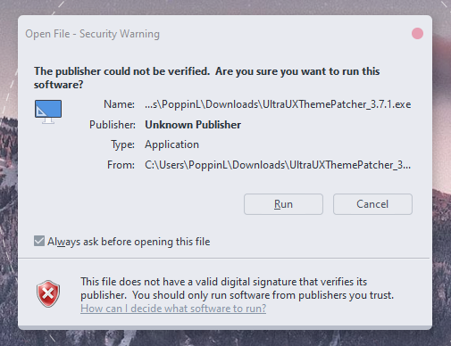

安装成功后也可以方便的在 windows 自带的 app 管理程序里删除。

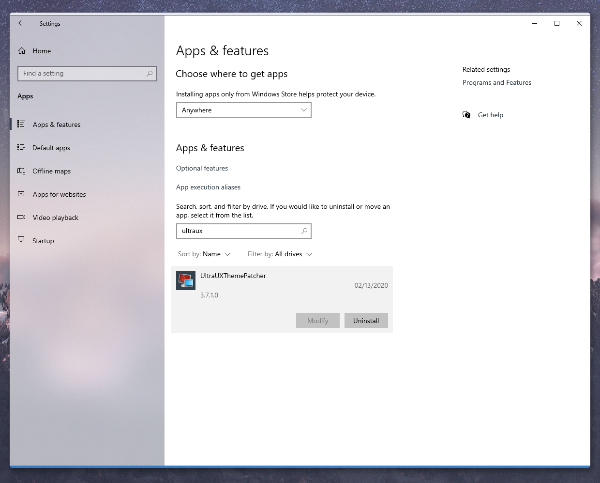

小伙伴们可以自行搜索这个工具的下载地址。这里给出一个墙内的[下载地址](http://file.zhutix.cn/UltraUXThemePatcher_3.7.1.exe)。侵删。

### 自定义主题

这是个很重要的部分，小猪这里找了一个自己比较喜欢的第三方主题『陶瓷灰 Porcelain Win10主题』，特点是比较简洁干净，饱和度比较低，

这个主题的地址在[这里](https://zhutix.com/pc/porcelain-vs/)，当然这个社区里也有很多其他的主题，小伙伴们可以自行取用。

这里放一张这个主题的预览图：

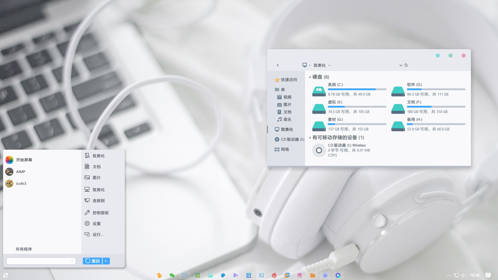

从上面的地址下载完之后，会得到一个 ZIP 压缩包。我们可以忽略里面其他的文件，执行里面的 `Porcelain_TW10.exe` 即可：

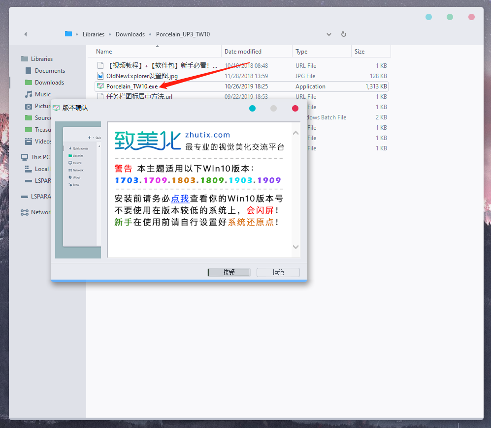

成功安装这个主题之后，我们可以打开 windows 控制面板里的个性化设置，在主题选项卡里面，我们就能看到刚才安装的这个主题啦，选择应用即可：

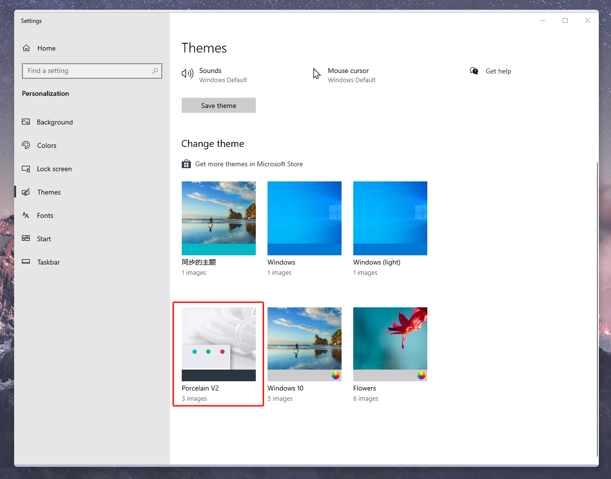

应用之后，系统应该会进入一个更换主题的 loading 状态，稍等片刻便能恢复正常。不过这时候会发现，当前的样子怎么这么丑，和我们想象的不太一样鸭！小猪当时也是这样想的，就像一个纯情的少女遇见了心目中的白马王子结果发现是个拔X无情的渣男一样。

但是别着急，我们还没结束。

### 轻拟物风格图标

主题风格已经变了，当然我们的图标风格也得跟上啦。这里推荐使用主题中推荐的这一套图标『Porcelain 轻拟物风格图标』，地址在[这里](https://zhutix.com/ico/porcelain-icons/)。顺便放一张这套图标的预览图：

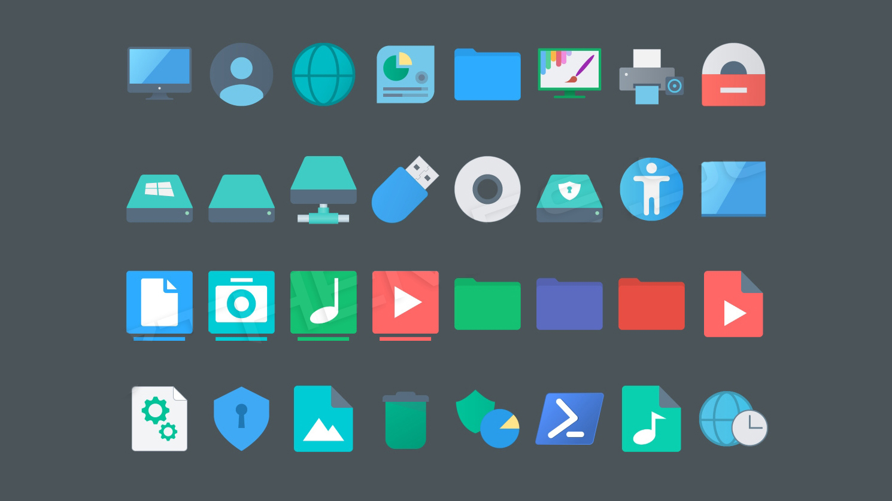

我们下载完解压后，会发现里面有三种类型的图标。如果你是比较新的 windows 10 版本，例如 1903 之后的版本，那么推荐使用 7tsp 格式的图标：

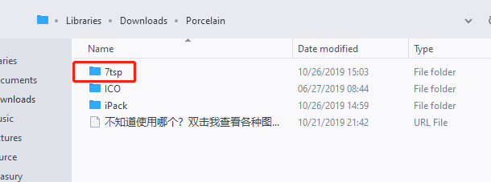

为了方便的使用这个格式的图标，我们可以先安装一个工具『7TSP GUI』。关于这个工具，小伙伴们可以自行搜索下载地址即可，这里给出一个[下载地址](https://www.lanzous.com/i6q6dzg)。侵删。

然后我们依次通过下图中的两个按钮，选择刚才下载的图标包里 7tsp 文件夹中的 7z 压缩包（不需要解压）并更新系统图片即可。这一步可能稍微需要花一点时间：

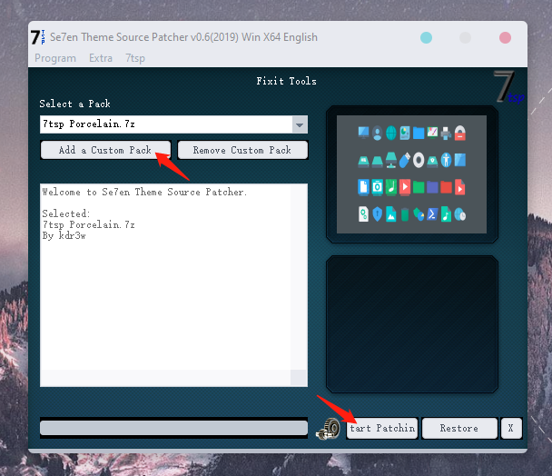

### OldNewExplorer

这是一个 windows 资源管理器界面的调整工具，可以用于调整资源管理器的顶部布局和背景图等功能。同样小伙伴们可以自行搜索下载地址，这里给出一个[下载地址](http://file.zhutix.cn/OldNewExplorer.zip)。侵删。

下载之后改程序并不需要安装，直接运行即可。我的配置如下，供小伙伴们参考：

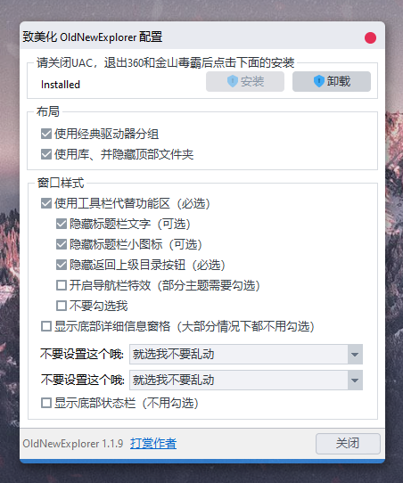

### StartIsBack++

这是一个 windows10 开始菜单以及任务栏样式的定义工具，不过由于里面可以设置的选项比较多，我这里就不一一截图啦。小伙伴们根据自己的喜好来自行调整。

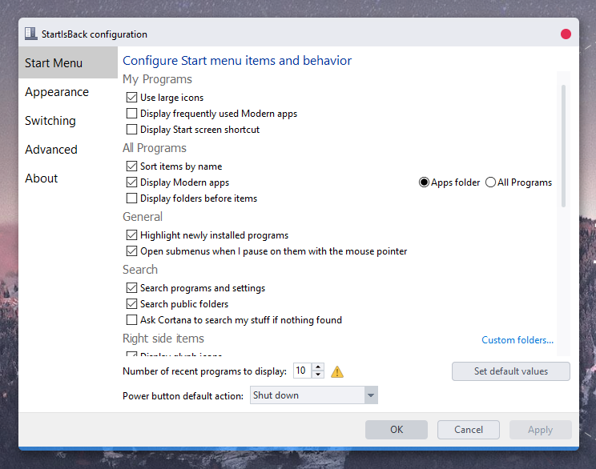

最后还是给出一个[下载地址](http://file.zhutix.cn/StartIsBack2.9.0.exe)供小伙伴们参考。侵删。

### Wallpaper Engine

最后，终于到了一个要付费的工具啦。当当当当，大名鼎鼎的 Wallpaper Engine。有没有独立的版本我不太清楚，不过我是在 steam 上下载使用的。什么？steam 是什么？快去问你的男票~

Wallpaper Engine 的商店页面如下。价格并不贵，所以也不用等打折啦，其实这个软件在 steamdb 的数据记录里，就没打过折。从此之后，steam 就成了我的 Wallpaper Engine 启动器啦，哈哈。

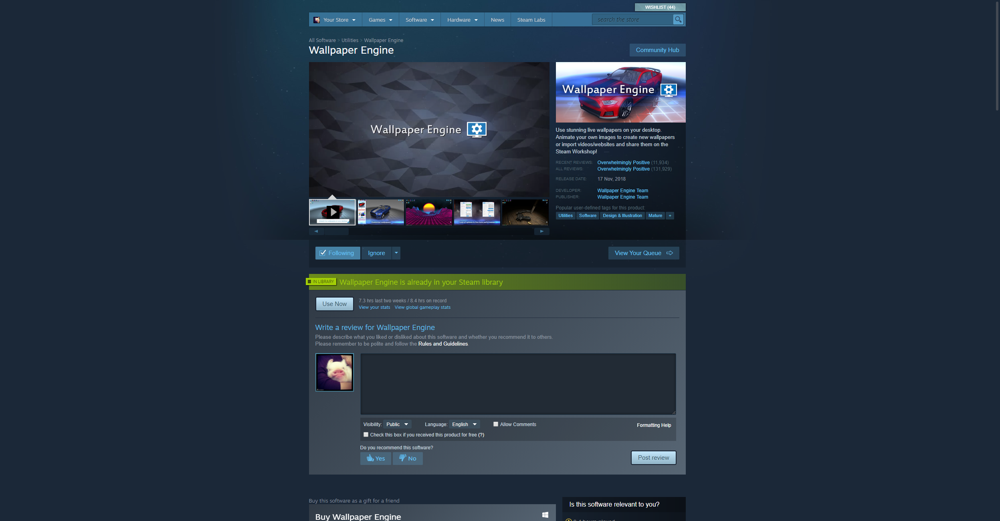

在 Wallpaper Engine 中我用了樱花粒子 + 动态音频时钟，产生了桌面上动态飘落的樱花花瓣，以及跟随音频的时钟。

不过关于具体在 Workshop 里如何挑选壁纸和效果，我这里就不截图了。毕竟 Wallpaper Engine 的 Workshop 里真是有太多各式♂各样的不可描述的内容了。

留给准备好了营养快线的小伙伴们自行探索8~

## 总结

小猪花了半个多小时的时间才折腾完这一次 windows 主题的优化。不过就结果来看，小猪自己还是很喜欢哒，应该能让我用上很长时间啦~

什么？你问 linux 桌面怎么折腾？玩游戏用什么 linux！哼 ╭(╯^╰)╮

最后，希望能帮到有需要的小伙伴们。如果你觉得不错的话，就三连支持小猪吧。小猪爱你们哟~

## 相关链接

- [我的 Github](https://github.com/poppinlp)
- [我的 segmentfault 专栏](https://segmentfault.com/blog/zxzfbz)
- [我的知乎专栏](https://zhuanlan.zhihu.com/zxzfbz)

