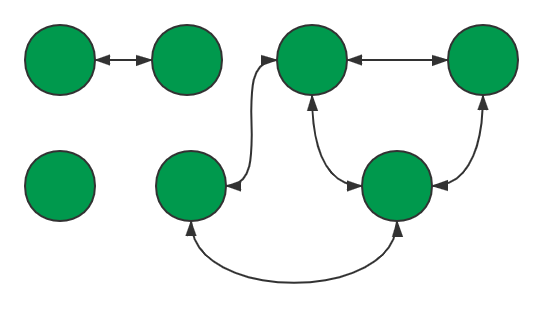
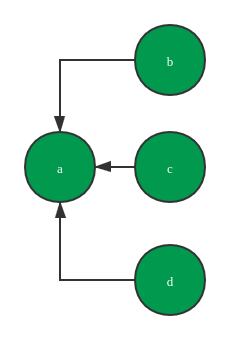
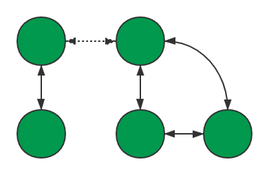

# 1319. 连通网络的操作次数

Hi 大家好，我是张小猪。欢迎来到『宝宝也能看懂』系列之 leetcode 周赛题解。

这里是第 171 期的第 3 题，也是题目列表中的第 1319 题 -- 『连通网络的操作次数』

## 题目描述

用以太网线缆将 `n` 台计算机连接成一个网络，计算机的编号从 `0` 到 `n-1`。线缆用 `connections` 表示，其中 `connections[i] = [a, b]` 连接了计算机 `a` 和 `b`。

网络中的任何一台计算机都可以通过网络直接或者间接访问同一个网络中其他任意一台计算机。

给你这个计算机网络的初始布线 `connections`，你可以拔开任意两台直连计算机之间的线缆，并用它连接一对未直连的计算机。请你计算并返回使所有计算机都连通所需的最少操作次数。如果不可能，则返回 `-1`。

示例 1：


```shell
输入：n = 4, connections = [[0,1],[0,2],[1,2]]
输出：1
解释：拔下计算机 1 和 2 之间的线缆，并将它插到计算机 1 和 3 上。
```

示例 2：


```shell
输入：n = 6, connections = [[0,1],[0,2],[0,3],[1,2],[1,3]]
输出：2
```

示例 3：

```shell
输入：n = 6, connections = [[0,1],[0,2],[0,3],[1,2]]
输出：-1
解释：线缆数量不足。
```

示例 4：

```shell
输入：n = 5, connections = [[0,1],[0,2],[3,4],[2,3]]
输出：0
```

提示：

- `1 <= n <= 10^5`
- `1 <= connections.length <= min(n*(n-1)/2, 10^5)`
- `connections[i].length == 2`
- `0 <= connections[i][0], connections[i][1] < n`
- `connections[i][0] != connections[i][1]`
- 没有重复的连接。
- 两台计算机不会通过多条线缆连接。

## 官方难度

MEDIUM

## 解决思路

题目内容并不复杂，就是给定了点的总数，以及一些目前点和点之间的连接关系。我们可以把任意一个连接放到任意的两点之间，每次这么做会令操作数加 1。最终需要返回联通全部点所需要最小的操作数。如果无法连通全部的点，则返回 `-1`。

读完之后我的第一反应是，这里给定的数据其实就是一个图，并且是无向且没有权重的图。那么我们先把无法连通全部点的特殊情况剔除掉吧。由于连接可以随便移动，也没有距离这种概念，所以对于 `n` 个点，我们如果有 `n-1` 个连接，则一定可以通过移动来连通全部的点。所以我们可以得到如下的一个先行判断：

```js
if (connections.length < n - 1) return -1;
```

接下来就是题目主体了，即如何获取到最小的操作数。我们可以想象一下，在最初题目给定了点和点的连接关系后，对于所有的点，可能会遇到 3 种不同的情况：

- 孤立的点。
- 和其他一个点连接在一起的点。
- 和其他多个点连接在一起的点。

而连接在一起的点，不管内部连接的方式如何，我们都可以认为它们组成了一个网络。并且单独的一个点我们也可以认为它是一个孤立的网络。那么在下图中，我们可以发现，存在着 3 个互不相连的网络。



如果我们想满足题目的需求，那么其实只需要把所有互不相连的网络打通即可。并且由于点之间的连接没有距离，可以随便移动。所以我们其实并不需要关心具体如何移动连接，我们只需要找到互不相连的网络的数量即可。因为我们需要的最小移动操作数便是互不相连的网络的数量减 1。

那么到这里，我们的问题便转换为了如何得到互不相连的网络的数量。对于这个问题，我们首先看看怎么找到一个网络中的所有的点。我们可以从任意一个点出发，假设它为 A，我们可以根据题目给定的关系，找到所有和它连接起来的点。然后再对后面这些点继续进行同样的操作，需要注意的是要过滤掉已经被访问过的点，避免无限循环。最终，我们会无法再得到未访问的点。那么包含着点 A 的这个网络的所有点就被找到了。

现在我们再回头看看需要解决的问题 -- 如何得到互不相连的网络的数量。我们可以尝试从每一个点出发，找到它所在的那个网络并标记。这样遍历完所有的出发点之后，我们便可以得到互不相连的网络的数量了。

### 直接方案

基于上面的思路，我们可以设想到，我们需要一个 `Map` 去记录连接到当前点的其他点。并且为了标记已访问过，我们需要一个 `visited` 数组。

具体流程如下：

1. 进行连接数量的先行判断。
2. 遍历给定的连接关系，得到每个点连接的所有其他点，记录在数组中。
3. 遍历所有点：
   1. 不断递归找到它所在的网络的所有点。
   2. 把这些点都标识为已访问。
   3. 互不相连的网络数量加 1。
4. 总的互不相连的网络数量减 1 即是最小需求的移动操作数。

基于以上流程，可以实现类似下面的代码：

```js
const makeConnected = (n, connections) => {
  if (connections.length < n - 1) return -1;
  const graph = new Map();
  const visited = new Uint8Array(n);
  for (const [a, b] of connections) {
    !graph.has(a) && graph.set(a, []);
    !graph.has(b) && graph.set(b, []);
    graph.get(a).push(b);
    graph.get(b).push(a);
  }

  let count = 0;
  for (let i = 0; i < n; ++i) count += helper(i);
  return count - 1;

  function helper(cur) {
    if (visited[cur]) return 0;
    visited[cur] = 1;
    if (graph.has(cur)) {
      for (const val of graph.get(cur)) helper(val);
    }
    return 1;
  }
};
```

相信有不少小伙伴会发现，这里的 `helper` 方法去取同网络中所有的点不就是深度优先遍历么。恭喜你，已经成为学习委员啦！

那么，是否可以用广度优先遍历实现呢？当然是可以的啦。小伙伴们可以自己尝试一下，这里我给一个例子：

```js
function helper(cur) {
  if (visited[cur]) return 0;
  const queue = [cur];
  for (let idx = 0; idx < queue.length; ++idx) {
    const val = queue[idx];
    visited[val] = 1;
    if (graph.has(val)) {
      for (const next of graph.get(val)) {
        visited[next] === 0 && queue.push(next);
      }
    }
  }
  return 1;
}
```

### 换个思路

重新回到题目给定的点和点的连接关系，我们换一种思路来考虑这个关系。

假设第一个连接关系是 a、b 两个点相连，那么我们可以认为它们是属于同一个集合。并且这里我们可以人为的添加一个方向，即我们可以假设最开始是有 a 点，那么 a 自己形成了一个集合，这个集合的名字就叫做 a。而发生了这个连接关系后，b 点加入了 a 这个集合。

假设这时候又产生了连接关系 a、c 和 b、d，那么很显然 c 和 d 也将加入 a 这个集合。目前的集合状态如下图所示：


那么我们该如何储存这个集合呢？一种很直接的方式就是基于 `Map` 来记录。例如：

```js
const connected = {
  a: 'a',
  b: 'a',
  c: 'a',
  d: 'b'
};
```

这样一来，对于任何一个点，如果我们想知道它属于哪一个集合，我们只需要不断的向下查找，直到找到一个点的值是自己，便表示到了末端，也就得到了集合的名字。这个查找的方法可以类似如下来实现：

```js
const find = (target, union) => {
  while (target !== union[target]) target = union[target];
  return target;
};
```

看到这个查找过程，相信小伙伴们会发现，链条越长，查找的越慢。所以在建立关系的时候，其实可以做一个小优化，即对于上面的 d 这个点，由于我们知道 b 不是端点，所以我们可以把 d 直接连到 b 所连的那个点。从而缩短链条的长度。这时候的集合状态如下图：



到了这里，随着我们不断的遍历连接关系，我们可能会遇到需要把两个互不相连的集合连接起来的情况。如下图所示，其中的虚线就是那个把左右两个集合连接起来的新连接：



看起来很吓人的样子，不过其实还是纸脑抚。因为我们还是只需要把一个集合的末端指向另外一个集合的末端即可。

综上，我们不断的根据给定的连接关系建立并丰富我们的集合。最终，没有被包含进这个大集合的点即是我们需要额外移动连接来连通的点。具体流程如下：

1. 进行连接数量的先行判断。
2. 初始化集合，每个孤点自己都是一个独立的集合。
3. 遍历给定的连接关系：
   1. 找到每个关系里两个点所属的集合。
   2. 如果不是同一个集合，则把这两个集合连起来，并计数。
4. 返回总的点数和我们计数的差值。

基于以上流程，可以实现类似下面的代码：

```js
const find = (target, union) => {
  while (target !== union[target]) target = union[target];
  return target;
};
const makeConnected = (n, connections) => {
  if (connections.length < n - 1) return -1;
  const connected = new Uint16Array(n);
  let count = 1;
  for (let i = 0; i < n; ++i) connected[i] = i;
  for (const [a, b] of connections) {
    const oa = find(a, connected);
    const ob = find(b, connected);
    if (oa !== ob) { connected[ob] = oa; ++count; }
  }
  return n - count;
};
```

上述代码其实算是这种并查集思路的模板代码，基于这种思路的问题都可以用类似的代码来实现。不过相信小伙伴们会发现，为了通用，其中对于每个连接关系中的两个点都是顺着链条找到了末端，然后再进行处理。并且为了达到这个目的，我们对每个点初始化了一个只包含它的孤立集合。那么这里有没有特定的更优化的方法呢？

在不初始化所有点为孤立集合的前提下，我们可以看看我们会遇到哪些具体的情况：

- 如果两个点都不属于任何集合。
- 一个点属于某个集合，一个点不属于。
- 两个点属于不同的集合。

对应的，我们可以用 3 种方式对它们进行处理：

- 把这两个点连接起来形成新的集合，集合数量加 1。
- 把独立的点连接进那个集合。
- 把这两个集合相连，集合数量减 1。

最终我们的结果就是点的总数，减去被纳入集合的点的数量，在加上集合的数量减 1。

基于特定情况优化后的代码如下：

```js
const makeConnected = (n, connections) => {
  if (connections.length < n - 1) return -1;
  const DEFAULT = n;
  const connected = new Uint16Array(n).fill(DEFAULT);
  let point = 0;
  let set = 0;
  for (let i = 0; i < connections.length; ++i) {
    const a = connections[i][0];
    const b = connections[i][1];
    const va = connected[a];
    const vb = connected[b];
    if (va === DEFAULT && vb === DEFAULT) {
      connected[a] = a;
      connected[b] = a;
      point += 2;
      ++set;
      continue;
    }
    if (va !== DEFAULT && vb !== DEFAULT) {
      let na = va, nb = vb;
      while (na !== connected[na]) na = connected[na];
      while (nb !== connected[nb]) nb = connected[nb];
      if (na !== nb) { connected[nb] = na; --set; }
      continue;
    }
    va === DEFAULT ? (connected[a] = vb) : (connected[b] = va);
    ++point;
  }
  return n - point + set - 1;
};
```

这段代码目前以 68ms 暂时 beats 100%。

## 总结

这道题给定的数据结构是一个图，不过我们暂时没有对于这个结构做过多展开介绍。而我们的处理方法中也用到了深度优先遍历、广度优先遍历以及并查集。这几种其实都是比较常见的处理方式，不知道小伙伴们有没有从中找到一点套路呢？

欢迎学习委员告诉一下小猪这几种思路的套路是什么鸭！小猪...小猪可以给你摸摸猪鼻子呢 >.< 哼唧

## 相关链接

- [Weekly Contest 171 题目列表](https://github.com/poppinlp/leetcode#weekly-contest-171)
- [系列题解 repo](https://github.com/poppinlp/leetcode)
- [我的 segmentfault 专栏](https://segmentfault.com/blog/zxzfbz)
- [我的知乎专栏](https://zhuanlan.zhihu.com/zxzfbz)


