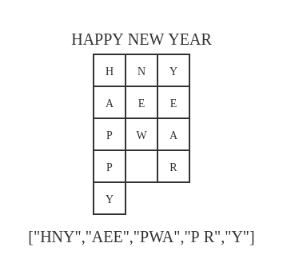

# 1324. 竖直打印单词

Hi 大家好，我是张小猪。欢迎来到『宝宝也能看懂』系列之 leetcode 周赛题解。

这里是第 172 期的第 2 题，也是题目列表中的第 1324 题 -- 『竖直打印单词』

## 题目描述

给你一个字符串 `s`。请你按照单词在 `s` 中的出现顺序将它们全部竖直返回。
单词应该以字符串列表的形式返回，必要时用空格补位，但输出尾部的空格需要删除（不允许尾随空格）。
每个单词只能放在一列上，每一列中也只能有一个单词。

示例 1：

```shell
输入：s = "HOW ARE YOU"
输出：["HAY","ORO","WEU"]
解释：每个单词都应该竖直打印。
 "HAY"
 "ORO"
 "WEU"
```

示例 2：

```shell
输入：s = "TO BE OR NOT TO BE"
输出：["TBONTB","OEROOE","   T"]
解释：题目允许使用空格补位，但不允许输出末尾出现空格。
"TBONTB"
"OEROOE"
"   T"
```

示例 3：

```shell
输入：s = "CONTEST IS COMING"
输出：["CIC","OSO","N M","T I","E N","S G","T"]
```

提示：

- `1 <= s.length <= 200`
- `s` 仅含大写英文字母。
- 题目数据保证两个单词之间只有一个空格。

## 官方难度

MEDIUM

## 解决思路

题目会给定一个包含多个单词的字符串，其中每个单词都是由英文大写字母组成，并且它们之间一定是由一个空格分隔开来。不过返回的结果直接看起来会怪怪的，因为是把每个单词从上到下纵向排列，然后各个单词从左到右组合在一起形成的一个字符串数组。也就是返回的数组中，第一个字符串是每个单词的第一个字母按照单词从左到右出现的顺序组成的，第二个字符串是每个单词的第二个字母，以此类推。

这里需要特别注意的一点是，由于每个单词的长度不一样，所以返回的字符串可能会有补位空格，不过并不保留多余的后缀空格。这一点应该就是这道题最容易弄错的地方啦。关于空格的问题，可以具体看看下面这个例子，应该就能明白：



那么我们接下来看看思路吧。首先从结果来看，从上面的例子我们可以看出，需求的这个字符串数组是可以直接由每个单词的第一个字母、第二个字母...这样子直接拼接起来的。而原始字符串中每个单词的分隔符固定是一个空格。所以非常容易能想到，我们可以先把原始字符串拆分成单词组，然后遍历拼接即可。

### 直接方案

思路大体成型之后，需要注意一下其中的细节，也就是特殊空格的处理。

由于后面的单词可能会比前面的长，所以对于前面的单词，我们是有可能需要去拼接补位空格的。例如上面图中例子里的那个 `P R`，这里就需要补充空格。

那是否意味着我们可以直接对于空缺的内容用空格来填充呢？当然并不是的。因为当后面没有较长的单词的时候，我们这时候如果再去拼接空格就会变成了空格后缀。而按照题目要求，这个类型的空格是需要去掉的。例如上面图中例子里的那个 `Y`。

这个问题的处理相信小伙伴也很容易能想到，小猪这里就不做过多分析啦。也就是我们可以把可能的空格先记录下来，但是并不做拼接。在后续有需要的时候再作为补位空格拼接进去即可。基于这个思路，具体流程如下：

1. 拆分原始字符串为单词组。
2. 遍历单词组，得到最长的单词的长度。
3. 根据最长的单词长度，遍历每个单词中对应的字符：
   - 如果是字母，则同补位空格一起拼接进结果数组，并重置补位空格为空字符串。
   - 如果是空，则记录进补位空格。
4. 返回结果数组。

基于这个流程，我们可以实现类似这样的代码：

```js
const printVertically = s => {
  const words = s.split(' ');
  let maxLen = 0;
  for (let i = 0; i < words.length; ++i) {
    if (words[i].length > maxLen) maxLen = words[i].length;
  }
  const ret = new Array(maxLen);
  for (let i = 0; i < maxLen; ++i) {
    ret[i] = '';
    let prevSpace = '';
    for (let j = 0; j < words.length; ++j) {
      words[j][i] === undefined
        ? (prevSpace += ' ')
        : ((ret[i] += prevSpace + words[j][i]), (prevSpace = ''));
    }
  }
  return ret;
};
```

### 换个思路

上面的流程里，我们会发现，其实存在着蛮多次遍历的，并且我们还需要去拆分原始字符串为单词组。对于这一部分，我们是否有办法可以优化呢？

回看刚才的思路和代码，我们的做法是去取每个单词的第 n 个字符，然后直接组成结果里的第 n 个字符串。如果把结果数组想象成是一个由字符组成的二维数组的话，这也就相当于我们是一行一行的拼接结果的。所以这也就需要我们先去拆出每个单词，并求得最长的单词的长度。说到这里，有的小伙伴可能会想到，除了一行一行的拼接之外，我们是否可以一列一列的拼接呢？

我们来看看，如果是一列一列的拼接的话，那么从第一列开始往后，其实不就是我们的每个单词本来的顺序么，也就是我们原始字符串本来的顺序。那如果这样拼接的话，就根本不需要去拆分单词组，也不需要去根据各个单词的字符来依次遍历了。我们直接从头开始遍历原始字符串不就好了么。妙鸭。

不过这里还是需要注意特殊空格的问题。由于我们是直接遍历原始字符串，所以在推进的过程中，我们并不知道是否应该去填补空格。例如对于前面图中的那个例子，对于 "YEAR" 中的 "R"，我们会直接把它和 "P" 拼在一起得到 "PR"，而不是 "P R"。那么我们如何解决这个问题呢？

仔细看上面 "R" 字母的例子，我们为什么需要的是 "P R"，是因为中间的那个单词这里是空缺的。换句话说就是，第一个单词这里有字母，第二个单词这里空缺，而第三个单词这里也有字母。再换句话说就是，对于第三个单词这里的字母，它期望的是前面已经有了两个字母，也就是字符串的长度为 2。所以当前面字符串的长度不足 2 的时候，我们需要用空格去填充。说到这里相信小伙伴们都明白了吧，我们只需要根据当前字母所属的是第几个单词，结合前面字符串的长度，即可完成对于补位空格的补充了。

基于这个思路，我们需要加入一个变量，用于记录当前遍历到第几个单词。具体流程如下：

1. 初始化当前单词为 0，以及单词中字符为 0。
2. 遍历整个原始字符串：
   - 如果遇到了空格，则单词数量加 1，单词中的字符重置为 0。
   - 如果遇到结果数组中还没到这一位长度，则直接填充可能的补位空格和当前字符进去。
   - 如果遇到结果数组中，前面字符串的长度不满足当前单词的这个字符的需求，则填补补位空格。然后再拼接入当前字符。
3. 返回结果数组。

基于这个流程，我们可以实现类似这样的代码：

```js
const printVertically = s => {
  const ret = [];
  for (let i = 0, idx = 0, word = 0; i < s.length; ++i, ++idx) {
    const char = s[i];
    if (char === ' ') { ++word; idx = -1; continue; }
    if (ret[idx] === undefined) { ret[idx] = ' '.repeat(word) + char; continue; }
    ret[idx].length !== word && (ret[idx] += ' '.repeat(word - ret[idx].length));
    ret[idx] += char;
  }
  return ret;
};
```

这段代码以 36ms 暂时 beats 100%。

## 总结

这是一道思路并不复杂的题，特别是其中直接方案的思路应该是可以根据题目要求顺理成章得到的。可是最后我们却发现，直接方案其实绕了一圈。而这些发现，正是来自于我们对于一些例子和结果对应关系的观察和思考。所以有时候真的不妨写一些可能的结果出来康康，然后我们就会发现其实它超勇的，因为答案就在里面了。>.<

所以，小伙伴们要不要来给小猪康康鸭，小猪超勇的，哈哈哈哈嗝。

## 相关链接

- [Weekly Contest 172 题目列表](https://github.com/poppinlp/leetcode#weekly-contest-172)
- [系列题解 repo](https://github.com/poppinlp/leetcode)
- [我的 segmentfault 专栏](https://segmentfault.com/blog/zxzfbz)
- [我的知乎专栏](https://zhuanlan.zhihu.com/zxzfbz)


