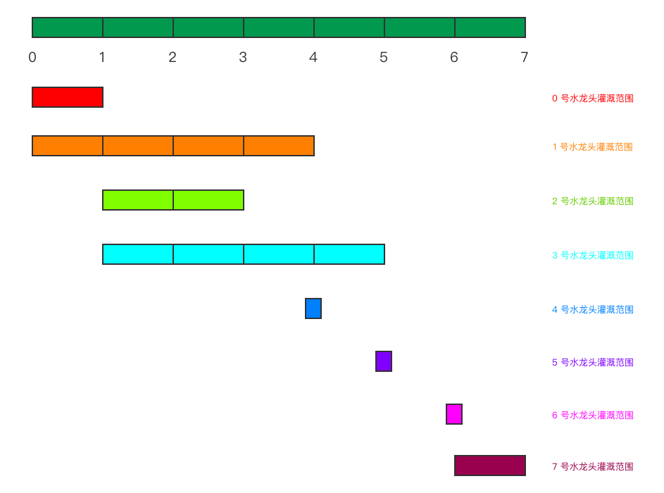

# 1326. 灌溉花园的最少水龙头数目

Hi 大家好，我是张小猪。欢迎来到『宝宝也能看懂』系列之 leetcode 周赛题解。

这里是第 172 期的第 4 题，也是题目列表中的第 1326 题 -- 『灌溉花园的最少水龙头数目』

## 题目描述

在 x 轴上有一个一维的花园。花园长度为 `n`，从点 `0` 开始，到点 `n` 结束。

花园里总共有 `n + 1` 个水龙头，分别位于 `[0, 1, ..., n]`。

给你一个整数 `n` 和一个长度为 `n + 1` 的整数数组 `ranges`，其中 `ranges[i]` （下标从 0 开始）表示：如果打开点 `i` 处的水龙头，可以灌溉的区域为 `[i -  ranges[i], i + ranges[i]]`。

请你返回可以灌溉整个花园的 **最少水龙头数目**。如果花园始终存在无法灌溉到的地方，请你返回 **-1**。

示例 1：


```shell
输入：n = 5, ranges = [3,4,1,1,0,0]
输出：1
解释：
点 0 处的水龙头可以灌溉区间 [-3,3]
点 1 处的水龙头可以灌溉区间 [-3,5]
点 2 处的水龙头可以灌溉区间 [1,3]
点 3 处的水龙头可以灌溉区间 [2,4]
点 4 处的水龙头可以灌溉区间 [4,4]
点 5 处的水龙头可以灌溉区间 [5,5]
只需要打开点 1 处的水龙头即可灌溉整个花园 [0,5] 。
```

示例 2：

```shell
输入：n = 3, ranges = [0,0,0,0]
输出：-1
解释：即使打开所有水龙头，你也无法灌溉整个花园。
```

示例 3：

```shell
输入：n = 7, ranges = [1,2,1,0,2,1,0,1]
输出：3
```

示例 4：

```shell
输入：n = 8, ranges = [4,0,0,0,0,0,0,0,4]
输出：2
```

示例 5：

```shell
输入：n = 8, ranges = [4,0,0,0,4,0,0,0,4]
输出：1
```

提示：

- `1 <= n <= 10^4`
- `ranges.length == n + 1`
- `0 <= ranges[i] <= 100`

## 官方难度

HARD

## 解决思路

题目的意思稍微容易有点让人误解。首先是题目给定了一个长度为 `n` 的花园，以及在上面平均分布的 `n + 1` 个水龙头，即从 `0` 到 `n`，把这个花园平均分割开。然后通过 `ranges` 数组，给定了每个水龙头喷水所覆盖的范围，通过下标和水龙头一一对应。最终需要返回可以灌溉整个花园所需的最少的水龙头数量，如果无法灌溉整个花园则返回 `-1`。

这里需要注意的是，如果水龙头的覆盖范围是 0，那么它其实对灌溉花园完全没有贡献。因为水龙头只是一个点，而不是有长度的一小段。如下图，是对于 `n = 7, ranges = [1, 3, 1, 2, 0, 0, 0, 1]` 这个数据的一个图示：



从图示中我们可以看到几种常见的状况：

- 「状况A」一个范围被另一个范围包含：如图中 0 号水龙头覆盖范围和 1 号水龙头覆盖范围。
- 「状况B」一个范围后紧接着另一个范围：如图中 0 号水龙头覆盖范围和 2 号水龙头覆盖范围。
- 「状况C」两个范围有交错但是互不完全包含：如图中 1 号水龙头覆盖范围和 3 号水龙头覆盖范围。
- 「状况D」长度为 0 的范围：如图中 4、5、6 号水龙头覆盖范围。
- 「状况E」不与其他任何范围交错或者包含的范围：如图中 7 号水龙头覆盖范围。

以上几种情况在后文的分析中都会用到，届时则直接使用对应的状况代号来称呼啦。那么接下来我们就开始分析具体的处理思路。

首先，为了灌溉整个花园，也就是期望每一段都被覆盖到，我们可以选定从 0 开始尝试逐步灌溉整个花园。以上面图示中的数据为例，我们逐步增加花园的长度来看看：

1. 假设花园长度是 1，则我们需要 0 号水龙头来完成灌溉。
2. 假设花园长度是 2，则我们需要 1 号水龙头来完成灌溉。
3. 假设花园长度是 3，则我们需要 1 号水龙头来完成灌溉。
4. 假设花园长度是 4，则我们需要 1 号水龙头来完成灌溉。
5. 假设花园长度是 5，则我们需要 1、3 号水龙头来完成灌溉。
6. 假设花园长度是 6，因为 5-6 这一段没有办法被灌溉，所以我们无法完成灌溉。
7. 假设花园长度是 7，虽然 6-7 这一段可以被覆盖，但是 5-6 这一段还是没有办法被灌溉，所以我们还是无法完成灌溉。

其中从长度 1 变成长度 2，我们遇到的是「状况A」。由于我们最终需要的只是最少的水龙头数量，所以对于「状况A」我们的最优处理方式就是直接选用更长的范围。从长度 2 变成到长度 4 的过程，都还是 1 号水龙头的覆盖范围，所以并不需要做变化。而从长度 4 变成长度 5，我们遇到的是「状况C」。对于这种状况，由于灌溉是允许范围重叠的，所以我们只需要同时选择两段范围即可。并且我们可以发现其实「状况B」就是「状况C」没有重叠的情况，所以我们可以直接用同样的处理逻辑。接下来，长度变成 6 和 7 以后，我们遇到了「状况D」和「状况E」，这时候我们无法完成灌溉。

经过上述过程的分析，相信小伙伴们应该已经发现了些蛛丝马迹。如果我们先忽略「状况D」和「状况E」的话，那么我们的逻辑其实非常明确，就是不断的应对两种情况：「状况A」的用更大的范围来替换小的范围；「状况B」和「状况C」的添加另一个范围。其中对于「状况A」的处理，我们可以理解为就是在寻找局部最优解。对于「状况B」和「状况C」的处理，我们可以理解为是在结合不同的局部最优解。最终我们就可以得到全局最优解。

这种基于局部最优解来得到全局最优解的过程，我们称为贪心算法。

### 直接方案

上述思路其实已经分析出了核心处理逻辑，不过还有另外一个问题就是如何获取局部最优解。如果从头开始遍历所有水龙头，对于遍历中的每一个水龙头的位置，从这里开始的最长的范围，也就是局部最优解，并不一定是在这之前出现的。因为可能会有后面的一个水龙头，它的覆盖范围很大，覆盖到了当前位置。

这里最直接的处理方式，我们可以再结合一个内部的遍历来找到从这个位置开始的局部最优解。不过这样做的话，我们需要 O(n^2) 的时间复杂度。这也就是这道题的 brute force 暴力解法。那么我们是否有更好的方式呢？

由于 `ranges` 已经给定后就不会变了，所以我们可以先算出每一个水龙头的覆盖范围，然后再进行一次排序，即可做到对于每一个位置我们先得到它的局部最优解。具体流程如下：

1. 根据 `ranges` 数组计算出所有水龙头的范围数组。
2. 对上述范围数组按照开始位置由小到大进行排序。如果开始位置一样，则按照结束位置由大到小排序。这样对于每一个开始位置，第一个值就是它的局部最优解。
3. 初始化计数、当前范围的开始和结束位置以及下一段范围的开始和结束位置。
4. 遍历排好序的范围数组：
   1. 如果范围的开始位置和结束位置一样，即「状况D」，则忽略这一段范围。
   2. 如果范围的开始位置和当前范围开始位置一样，即不是当前位置的局部最优解，则忽略这一段范围。
   3. 如果范围的开始位置和下一段范围的开始位置一样，即不是下一个位置的局部最优解，则忽略这一段范围。
   4. 如果范围的开始位置不大于当前范围的结束位置，即「状况B」和「状况C」，则根据范围的结束位置来更新下一段范围。
   5. 如果范围的开始位置大雨下一段范围的结束位置，即「状况E」，则结束循环并返回 `-1`。
   6. 将当前范围更新为下一段范围，将下一段范围更新为遍历中的范围，增加计数。
5. 判断目标长度和当前范围、下一段范围之间的关系，返回修正后的计数结果。

基于这个流程，我们可以实现类似这样的代码：

```js
const minTaps = (n, ranges) => {
  const calRanges = ranges.map((range, idx) => [idx - range < 0 ? 0 : idx - range, idx + range > n ? n : idx + range]).sort((a, b) => (a[0] === b[0] ? b[1] - a[1] : a[0] - b[0]));
  let count = 1;
  let left = nleft = calRanges[0][0];
  let right = nright = calRanges[0][1];
  for (const range of calRanges) {
    if (range[0] === range[1] || range[0] === left || range[0] === nleft) continue;
    if (range[0] <= right) {
      nleft = range[0];
      if (range[1] > nright) { nright = range[1]; }
      continue;
    }
    if (nright < range[0]) return -1;
    left = nleft;
    right = nright;
    nleft = range[0];
    nright = range[1];
    ++count;
  }
  if (right < n && nright < n) return -1;
  return right === n ? count : count + 1;
};
```

### 换个思路

上面的代码中使用了一个开销 O(nlogn) 的排序来确保局部最优解的获取。那么是否有方法来优化这一部分呢？~~没有，文章结束。~~

既然这样说了，那当然是有的啦。我们在第一次遍历 `ranges` 的过程中，其实可以不用生成每一个范围，而是直接尝试根据计算的开始位置和结束位置，更新对应的开始位置的局部最优解的值。同理，后续的遍历计数中的流程也简单很多。具体流程如下：

1. 根据 `ranges` 数组计算出每个位置的局部最优解。
2. 初始化计数、当前范围的结束位置以及下一段范围的结束位置。
3. 遍历所有位置：
   1. 如果循环位置大于下一段范围的结束位置，即「状况E」，则结束循环并返回 `-1`。
   2. 如果循环位置大于当前范围的结束位置，则更新当前范围的结束位置为下一段范围的结束位置，并计数。
   3. 根据循环位置的局部最优解，更新下一段范围的结束位置。
4. 返回计数。

```js
const minTaps = (n, ranges) => {
  const LEN = ranges.length;
  const calRanges = new Uint16Array(LEN);
  for (let i = 0; i < LEN; ++i) {
    const left = i - ranges[i] > 0 ? i - ranges[i] : 0;
    const right = i + ranges[i] < n ? i + ranges[i] : n;
    right > calRanges[left] && (calRanges[left] = right);
  }
  let count = 1;
  let cur = next = calRanges[0];
  for (let i = 1; i < LEN; ++i) {
    if (i > next) return -1;
    if (i > cur) { cur = next; ++count; }
    calRanges[i] > next && (next = calRanges[i]);
  }
  return count;
};
```

### 优化

上面代码的时间复杂度已经是 O(n) 了，不过空间复杂度也是 O(n)，我们是否可以优化到 O(1) 的空间复杂度呢？

如果仔细观察上述代码的逻辑，其实可以发现，我们是可以做到的。因为我们额外的 `calRanges` 数组其实并不必须，我们完全可以直接利用 `ranges` 数组来保存所有的局部最优解。这里的具体逻辑如下：

首先，对于给定的 `ranges` 数组中的每一个值，我们可以认为它就是对应的那个位置的局部最优解的初始值。举个具体的例子，假设 `ranges[2] === 3`，那么对于 2 这个水龙头的位置开始，局部最优解至少是到位置 5。而其他的水龙头是否可能更新这个局部最优解，就是我们需要在遍历中完成计算和更新的部分。例如假设 `ranges[4] === 2`，那么刚才 2 这个位置的局部最优解就应该被更新为到位置 6。

这个逻辑想通了之后，我们只需要在上面的代码中稍做修改即可实现 O(1) 空间复杂度的目标。具体代码如下：

```js
const minTaps = (n, ranges) => {
  for (let i = 0; i < ranges.length; ++i) {
    const left = i - ranges[i] > 0 ? i - ranges[i] : 0;
    const right = i + ranges[i] < n ? i + ranges[i] : n;
    right > ranges[left] && (ranges[left] = right);
  }
  let count = 1;
  let cur = next = ranges[0];
  for (let i = 1; i < ranges.length; ++i) {
    if (i > next) return -1;
    if (i > cur) { cur = next; ++count; }
    ranges[i] > next && (next = ranges[i]);
  }
  return count;
};
```

这段代码跑了 40ms 暂时 beats 100%。

## 总结

这道题是一道比较典型的贪心算法的问题。一旦想到这一点并理清思路，那么 AC 代码应该不是什么问题。剩下的只是后续的优化了。所以重点还是前面的分析部分，即我们如何通过例子来想到这种贪心策略的使用。过程中我们使用到了局部最优解和全局最优解这两个概念，不知道是否有小伙伴可以帮小猪总结一下，什么样的情况下才可以基于局部最优解来得到全局最优解呢？

**加油武汉，天佑中华**

## 相关链接

- [Weekly Contest 172 题目列表](https://github.com/poppinlp/leetcode#weekly-contest-172)
- [系列题解 repo](https://github.com/poppinlp/leetcode)
- [我的 segmentfault 专栏](https://segmentfault.com/blog/zxzfbz)
- [我的知乎专栏](https://zhuanlan.zhihu.com/zxzfbz)


