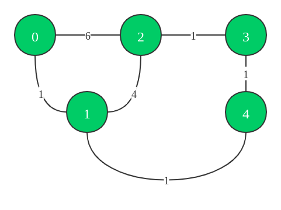
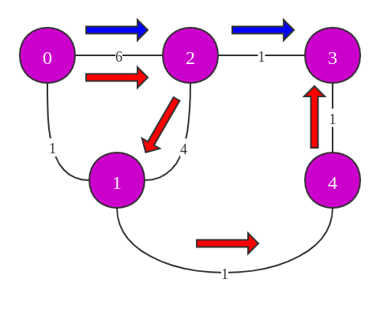

# 1334. 阈值距离内邻居最少的城市

Hi 大家好，我是张小猪。欢迎来到『宝宝也能看懂』系列之 leetcode 周赛题解。

这里是第 173 期的第 3 题，也是题目列表中的第 1334 题 -- 『阈值距离内邻居最少的城市』

## 题目描述

有 `n` 个城市，按从 `0` 到 `n-1` 编号。给你一个边数组 `edges`，其中 `edges[i] = [fromᵢ, toᵢ, weightᵢ]` 代表 `fromᵢ` 和 `toᵢ` 两个城市之间的双向加权边，距离阈值是一个整数 `distanceThreshold`。

返回能通过某些路径到达其他城市数目最少、且路径距离 **最大** 为 `distanceThreshold` 的城市。如果有多个这样的城市，则返回编号最大的城市。

注意，连接城市 `i` 和 `j` 的路径的距离等于沿该路径的所有边的权重之和。

示例 1：


```shell
输入：n = 4, edges = [[0,1,3],[1,2,1],[1,3,4],[2,3,1]], distanceThreshold = 4
输出：3
解释：城市分布图如上。
每个城市阈值距离 distanceThreshold = 4 内的邻居城市分别是：
城市 0 -> [城市 1, 城市 2]
城市 1 -> [城市 0, 城市 2, 城市 3]
城市 2 -> [城市 0, 城市 1, 城市 3]
城市 3 -> [城市 1, 城市 2]
城市 0 和 3 在阈值距离 4 以内都有 2 个邻居城市，但是我们必须返回城市 3，因为它的编号最大。
```

示例 2：


```shell
输入：n = 5, edges = [[0,1,2],[0,4,8],[1,2,3],[1,4,2],[2,3,1],[3,4,1]], distanceThreshold = 2
输出：0
解释：城市分布图如上。
每个城市阈值距离 distanceThreshold = 2 内的邻居城市分别是：
城市 0 -> [城市 1]
城市 1 -> [城市 0, 城市 4]
城市 2 -> [城市 3, 城市 4]
城市 3 -> [城市 2, 城市 4]
城市 4 -> [城市 1, 城市 2, 城市 3]
城市 0 在阈值距离 4 以内只有 1 个邻居城市。
```

提示：

- `2 <= n <= 100`
- `1 <= edges.length <= n * (n - 1) / 2`
- `edges[i].length == 3`
- `0 <= fromᵢ < toᵢ < n`
- `1 <= weightᵢ, distanceThreshold <= 10^4`
- 所有 `(fromᵢ, toᵢ)` 都是不同的。

## 官方难度

MEDIUM

## 解决思路

看完题目的第一反应，又是套路。哼，看小猪一套带走你！

题目的内容非常直白，就不做过多解释啦。我们如果抽象的看题目提供的数据，把城市想象成一个个点，城市之间的道路想象成点之间的连线，而道路的长度就是线的权重，那么题目提供的数据其实就是一个无向有权的图。

无向的意思是连线是没有方向的。例如假设从 A 到 B 的直接距离是 3，那么从 B 到 A 的直接距离也就是 3。而有权的意思就是，我们不同点之间的连线可能是不一样的。例如假设从 A 到 B 的直接距离是 3，那么从 B 到 C 的直接距离可能是 5。这就是它们的权重不一样。

上面这里为什么要先解释这个无向有权的问题，因为对于图来说，其实处理的方式可以有很多。而其中有没有方向、有没有权重，会影响到我们后续处理数据的逻辑。

不过要是继续这样说下去，那也太不是小猪的风格啦！小猪先说这个概念，就是想让还不知道的小伙伴们不要被那些奇奇怪怪的名词吓到。哼！都是纸脑抚！小猪的风格，当然还是先从一个栗子出发啦。



对应着上面的图，假设我们拿到的数据是：

```js
5
[
  [1, 4, 10],
  [0, 2, 6],
  [3, 4, 1],
  [1, 2, 2],
  [1, 0, 1],
  [3, 2, 3],
]
4
```

那么我们面临的第一个问题就是，如何储存这些数据，毕竟每一次都去遍历搜索肯定是不现实的。这里我们可以预想到需要频繁访问的数据是每个线段的长度，那么对应的也就会希望这个访问是 O(1) 时间消耗的。说到这里，相信小伙伴们已经想到啦，那就是直接用索引去 mapping 即可。由于我们的数据中点的名字正好都是从 0 开始的连续数字，所以自然的可以基于数组下标来进行标识。于是乎，第一个问题便迎刃而解。我们可以得到类似下面的代码：

```js
// JS 的多维数组呀，说多了都是泪 T_T
const distance = Array.from({ length: n }, () => new Uint16Array(n));
for (const edge of edges) {
  distance[edge[0]][edge[1]] = distance[edge[1]][edge[0]] = edge[2];
}
```

接下来就到了核心的问题，那就是如何知道每一个点到其他点的最短距离。我们可以先来看看上面栗子中，从 0 号城市出发到 2 号城市的情况：

- 0 到 2 的直接距离是 6。
- 0 到 1 的直接距离是 1：
  - 1 到 2 的直接距离是 4。
  - 1 到 4 的直接距离是 1：
    - 4 到 3 的直接距离是 1：
      - 3 到 2 的直接距离是 1。

我们这里列举出了所有不包含回头路的情况，可以看到从 0 到 2 的路线其实是有 3 条的：

- 0 -> 2，总距离 6。
- 0 -> 1 -> 2，总距离 5。
- 0 -> 1 -> 4 -> 3 -> 2，总距离 4。

这里其实可以得到几个简单的信息：

1. 我们不用考虑回头路的情况，因为我们要知道的是最短距离，并且我们道路的长度都是正数。
2. 两个点之间的直接距离不一定是最短的。
3. 看起来很长的路径，真正的直接距离不一定长。

说到这里，相信小伙伴们已经发现了，我们没办法通过一些计算的方式去直接求得这个结果。只能基于数据去遍历每一种情况才能知道最终的结果。

### 深度优先遍历？

既然提到了遍历，又是从起点到终点上的路径的距离和，那么可能会有小伙伴想到我们是不是可以用之前说过的深度优先遍历呢？我们可以尝试一下。

假设我们现在需要找到从 0 到 3 的最短距离。于是我们开始进行遍历。假设现在的遍历是先访问 2 号点。那么情况可以能是这样：



我们会先后获取到两条路线，分别是 0 -> 2 -> 3，长度是 7；0 -> 2 -> 1 -> 4 -> 3，长度是 12。

而在深度优先遍历中，为了防止无限循环已经访问过的点，所以我们会用一个集合记录已经访问过的点。在上面的遍历进行过程中，如果我们用紫色来标识已经被访问过的点，那么结果就是当前所有的点都已经被访问过了。

接下来，遍历继续进行。来到了 0 -> 1 这条线路。然而由于已经被访问过了，所以就不会继续走下去了。但是，其实我们知道，从 0 到 3 的最短路径就是这条线路 0 -> 1 -> 4 -> 3，长度是 3。

这是一个最初解决这个问题很容易犯的错误。包括广度优先遍历也是一样的道理。不过其实我们也不是不可以用深度优先遍历来实现，只是逻辑会更复杂一些。并且由于效率也不高，所以我们也许可以尝试换一个思路来解决。

### Floyd Warshall 算法

我们先忽略这个看起来很吓人的名字，把视线回到上面的栗子中。

在前面的分析中，我们已经列举过了从 0 到 2 的所有情况。虽然有 3 条路径，不过都可以归结成两种，即从 0 直接到 2，或者从 0 借助其他点再到 2。至于借助多个点的路径，可以理解成从 0 借助 3 到 2；而 0 到 3 又没有直接连接，所以便可从 0 借助 4 到 3。以此类推。

我们可以把上面的分析再换成比较抽象的点，例如从 i 到 j 的最短距离。假设这个最短距离为 `d[i][j]`，那么它可能来自于这两个点的直接距离 `graph[i][j]`，或者是借助 k 点以完成的连接 `d[i][k] + d[k][j]`。至于这里的 `d[i][k]` 和 `d[k][j]` 也就同理可以得到了。

当我们基于上面的思路，计算出每一个点到其他点的最短距离了之后。剩下的就非常简单了，根据题目给定的阈值进行计数和判断即可得到结果。具体流程如下：

1. 根据提供的数据，初始化这个图的存储。由于我们需要算出最短距离，所以可以把不存在的连线填充为一个非常大的数，从而方便后续计算。这里由于权重的范围是 `[1, 10^4]`，所以我填充了 `10001`。
2. 尝试列举所有的可能，从 a 点借助 b 点到 c 点，然后根据仅有的两种结果来进行判断，并更新 a 点到 c 点的最短距离。
3. 根据题目给定的阈值，遍历计数，并得到结果。

基于以上流程，可以得到类似下面的代码：

```js
const findTheCity = (n, edges, distanceThreshold) => {
  const distance = Array.from({ length: n }, () => new Uint16Array(n).fill(10001));
  for (const edge of edges) {
    distance[edge[0]][edge[1]] = distance[edge[1]][edge[0]] = edge[2];
  }
  for (let i = 0; i < n; ++i) {
    for (let j = 0; j < n; ++j) {
      for (let k = 0; k < n; ++k) {
        if (k === j) continue;
        distance[j][k] = Math.min(distance[j][k], distance[j][i] + distance[i][k]);
      }
    }
  }

  let city = 0;
  let minNum = n;
  for (let i = 0; i < n; ++i) {
    let curNum = 0;
    for (let j = 0; j < n; ++j) {
      distance[i][j] <= distanceThreshold && ++curNum;
    }
    if (curNum <= minNum) { minNum = curNum; city = i; }
  }
  return city;
};
```

### 优化

上面的代码中，3 层 `for` 循环的结构可以理解成是 Floyd Warshall 算法的非常模板的实现。只要需要基于这个算法来解决问题，都可以套这样的模板。不过具体根据情况，我们也可以做一点小小的优化。下面的代码主要做了两点小改动：

1. 由于这是个无向图，所以我们的 `distance` 矩阵其实是沿着对角线对称的。自然的，我们也就只需要进行一半的计算即可。
2. 我们可以根据一些条件提前结束掉不必要的循环和计算，例如从 a 到 b 的最短距离，其中以 a 为中间点，或者以 c 为中间点但是 a 和 c 不存在通路的情况，其实就不必要进行后续的处理了。

```js
const findTheCity = (n, edges, distanceThreshold) => {
  const MAX = 10001;
  const distance = Array.from({ length: n }, () => new Uint16Array(n).fill(MAX));
  for (const edge of edges) {
    distance[edge[0]][edge[1]] = distance[edge[1]][edge[0]] = edge[2];
  }
  for (let i = 0; i < n; ++i) {
    for (let j = 0; j < n; ++j) {
      if (i === j || distance[j][i] === MAX) continue;
      for (let k = j + 1; k < n; ++k) {
        distance[k][j] = distance[j][k] = Math.min(distance[j][k], distance[j][i] + distance[i][k]);
      }
    }
  }

  let city = 0;
  let minNum = n;
  for (let i = 0; i < n; ++i) {
    let curNum = 0;
    for (let j = 0; j < n; ++j) {
      distance[i][j] <= distanceThreshold && ++curNum;
    }
    if (curNum <= minNum) { minNum = curNum; city = i; }
  }
  return city;
};
```

这段代码目前跑出了 64ms 暂时 beats 100%.

## 总结

其实小猪一直很犹豫，究竟要不要加入一些看似吓人的名词。所以这篇文章小猪拖更了很久。（才不是在为拖更找借口呢，哼

最终小猪还是决定用直白的栗子和语言来解释思路，但是会提到那些看起来奇奇怪怪的名词。主要是希望不太了解的小伙伴们以后不会再被这些名词吓到啦。毕竟它们都是纸脑抚，小伙伴们和小猪都是最棒(pang)哒！耶~（过完这个年，真的是最 pang 的了...T_T

回到这道题目，关于图的处理方式真的有很多。这道题其实我们还可以用挺多其他方式去处理的，例如 Bellman–Ford、Dijkstra 等等。有兴趣的小伙伴可以催更一下小猪快点去写关于图的专题内容。么么嗒~

最后，关于上面的优化代码，其实是还有优化空间的。可是小猪苯苯的，有没有小伙伴可以帮帮小猪呢？ >.<

**加油武汉，天佑中华**

## 相关链接

- [Weekly Contest 173 题目列表](https://github.com/poppinlp/leetcode#weekly-contest-173)
- [系列题解 repo](https://github.com/poppinlp/leetcode)
- [我的 segmentfault 专栏](https://segmentfault.com/blog/zxzfbz)
- [我的知乎专栏](https://zhuanlan.zhihu.com/zxzfbz)


