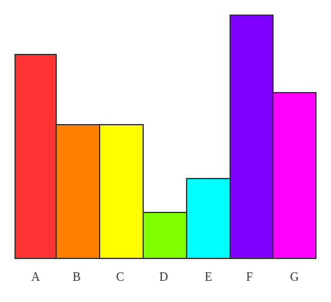
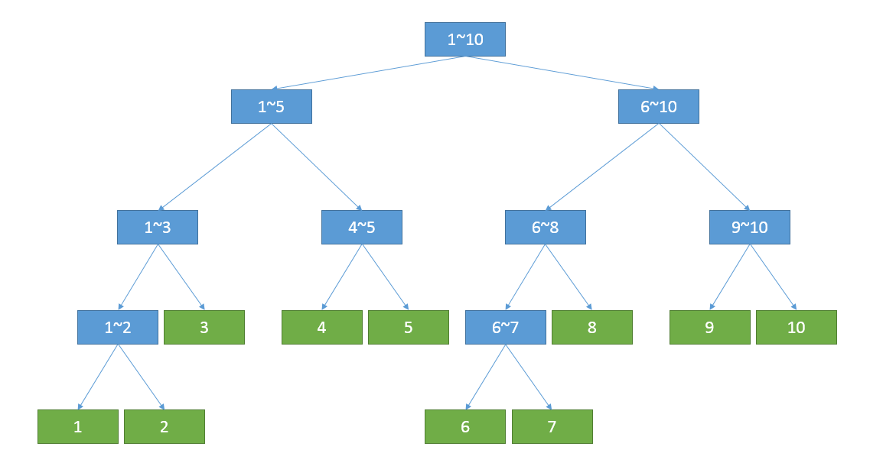
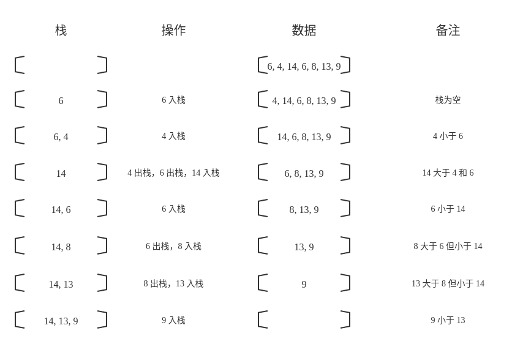

# 1340. 跳跃游戏 V

Hi 大家好，我是张小猪。欢迎来到『宝宝也能看懂』系列之 leetcode 周赛题解。

这里是第 174 期的第 4 题，也是题目列表中的第 1340 题 -- 『跳跃游戏 V』

## 题目描述

给你一个整数数组 `arr` 和一个整数 `d`。每一步你可以从下标 `i` 跳到：

- `i + x`，其中 `i + x < arr.length` 且 `0 < x <= d`。
- `i - x`，其中 `i - x >= 0` 且 `0 < x <= d`。

除此以外，你从下标 `i` 跳到下标 `j` 需要满足：`arr[i] > arr[j]` 且 `arr[i] > arr[k]`，其中下标 `k` 是所有 `i` 到 `j` 之间的数字（更正式的，`min(i, j) < k < max(i, j)`）。

你可以选择数组的任意下标开始跳跃。请你返回你 **最多** 可以访问多少个下标。

请注意，任何时刻你都不能跳到数组的外面。

示例 1：


```shell
输入：arr = [6,4,14,6,8,13,9,7,10,6,12], d = 2
输出：4
解释：你可以从下标 10 出发，然后如上图依次经过 10 --> 8 --> 6 --> 7 。
注意，如果你从下标 6 开始，你只能跳到下标 7 处。你不能跳到下标 5 处因为 13 > 9 。你也不能跳到下标 4 处，因为下标 5 在下标 4 和 6 之间且 13 > 9 。
类似的，你不能从下标 3 处跳到下标 2 或者下标 1 处。
```

示例 2：

```shell
输入：arr = [3,3,3,3,3], d = 3
输出：1
解释：你可以从任意下标处开始且你永远无法跳到任何其他坐标。
```

示例 3：

```shell
输入：arr = [7,6,5,4,3,2,1], d = 1
输出：7
解释：从下标 0 处开始，你可以按照数值从大到小，访问所有的下标。
```

示例 4：

```shell
输入：arr = [7,1,7,1,7,1], d = 2
输出：2
```

示例 5：

```shell
输入：arr = [66], d = 1
输出：1
```

提示：

- `1 <= arr.length <= 1000`
- `1 <= arr[i] <= 10^5`
- `1 <= d <= arr.length`

## 官方难度

HARD

## 解决思路

题目的意思还是稍微解释一下吧。首先是给定了一个数组 `arr`，其中每一个值表示当前下标的高度。然后给定了一个每次移动的最远距离 `d`。可以以任何一个点为出发点，需求是想找到能移动的最大的步数。

每一次移动需要从当前位置开始，向左和右最大为 `d` 的范围内，选择下一步的位置。其中在移动的时候，我们的途径点一定都需要是比当前位置低才行，即我们无法到达与当前位置高度想等或者比当前位置高的地方，哪怕还处于最大范围 `d` 之中。并且我们不能移动到数据外面去，即目标地点不能超过下标范围 `[0, arr.length)`。

如果还是比较难明白的话，我们可以先看一下下面这个图：



假设最大的移动范围为 2，那么结合上图以及题目的要求，可以总结几个栗子：

- 无法从 A 移动到 D，因为超出了最大距离 2。
- 无法从 G 移动到 E，因为中间的 F 高度比 G 高。
- 无法从 B 移动到 D，因为中间的 C 高度和 B 一样。
- 可以从 A 移动到 C，因为位于最大范围之内，并且中间的高度都比 A 要低。
- 可以从 C 移动到 D 或者 E。

理完题目之后，接下来看看如何处理这个问题。按照惯例，我们对于上图中的情况，可以先尝试写可能的路线看看。

- 如果我们是从 C 点出发，那么我们可以直接到达的下一步是，D 和 E。
- 如果我们是从 E 点出发，那么我们的下一步只有 D。
- 如果我们是从 D 点出发，那么我们没有可以选择的下一步了。

上面是以从 C 点出发开始，展开的一个栗子。其实我们也可以尝试一下，从其他的点出发，会发现都可以展开成类似的栗子。即基于当前的位置我们可以尝试判断条件后找出下一步可能的位置，并且不断轮回。直到我们没有下一步了，就能得到一条完整的路线了，从而也就知道了这条路线的长度。

如果我们知道了从一个点出发的所有路线的长度，那么其实也就知道了以这个点为出发点的最大步数。如果我们要写成类似公式的话其实就是：`dp[i] = 1 + Math.max(dp[j]: j in range[i])`。

而如果我们知道了所有点的最大步数，也就能得到最终题目的需求了。

下面小猪爆肝了 5 种方案，希望喜欢的小伙伴们多多三连支持！（等等，好像这不是 B 站啊喂 >.<

### 直接方案

回看上面的分析过程，其实会发现，如果放在程序里的话，这就是一个不断递归的过程。而整个寻找的方案，其实就是我们熟悉的深度优先遍历。那么我们来尝试整理一下流程吧，千万别忘了用缓存，否则性能会差很多。

1. 初始化缓存。
2. 尝试以每一个点都作为起点，寻找它的下一步，并通过比较求得最大值。
3. 基于最远范围和高度，判断可能的下一步。
4. 不断的递归寻找，直到没有下一步了，则结束递归。

基于这个流程，我们可以实现类似下面的代码：

```js
const maxJumps = (arr, d) => {
  const cache = new Uint16Array(arr.length);
  return Math.max(...arr.map((v, i) => helper(i)));

  function helper(cur) {
    if (cache[cur] === 0) {
      let max = 0;
      for (let i = cur + 1; i <= cur + d && i < arr.length && arr[i] < arr[cur]; ++i) {
        max = Math.max(helper(i), max);
      }
      for (let i = cur - 1; i >= cur - d && i >= 0 && arr[i] < arr[cur]; --i) {
        max = Math.max(helper(i), max);
      }
      cache[cur] = 1 + max;
    }
    return cache[cur];
  }
};
```

### 换个思路

上面那个思路我们可以认为是一种自顶向下的分解方式，即我们把一个大的任务拆分成许多小的任务，然后再根据这些小任务的结果来得到大任务的结果。那么我们是否可以换一个方向，自底向上的来解决这个问题呢？

这样处理的话，意味着我们每次都需要知道当前可以完成的小任务，完成之后再去寻找下一批可以由当前状况组合推断的大任务。直到我们的大任务覆盖了所有内容，也就完成了最终的目标。那么问题来了，~~挖掘机~~ 我们如何知道目前的小任务呢？

这里我们可以回头看一下题目的条件，即只能从比较高的地方走到比较低的地方。那么对于所有位置中，高度最低的地方，其实它的值已经确定了，因为到这里之后便无路可走。

那么顺着这个思路，对高度第二低的地方呢？这时候它的最大值其实还是不确定的，因为它有可能能够去到最低的地方，那么最大值便是 2；也有可能无法去到最低的地方，那么最大值便是 1。所以我们需要做相关的判断才能得到结果。

那么再继续，以这样从低到高的顺序，我们如何求得任意一个位置的最大值呢？由于所有的比它低的位置已经有最大值了，所以其实很简单，就是找到那些可能走到并且有值的位置里面的最大值，然后加 1 即可。

基于这个思路，我们可以整理出如下流程：

1. 按照高度把原始数据进行排序。
2. 从低到高开始，更新以当前点为出发点时的最大步数：
   1. 寻找当前点有值的下一步。
   2. 取最大值并加 1 做为当前点的最大步数。
3. 比较并记录最终的最大步数。

基于这个流程，我们可以实现类似下面的代码：

```js
const maxJumps = (arr, d) => {
  const LEN = arr.length;
  const sortedHeights = arr.map((val, idx) => [val, idx]).sort((a, b) => a[0] === b[0] ? a[1] - b[1] : a[0] - b[0]);
  const steps = new Uint16Array(LEN);
  let ret = 0;
  for (const [height, cur] of sortedHeights) {
    let max = 0;
    for (let i = cur + 1; i <= cur + d && i < LEN && arr[i] < height; ++i) {
      steps[i] > max && (max = steps[i]);
    }
    for (let i = cur - 1; i >= cur - d && i >= 0 && arr[i] < height; --i) {
      steps[i] > max && (max = steps[i]);
    }
    steps[cur] = max + 1;
    steps[cur] > ret && (ret = steps[cur]);
  }
  return ret;
};
```

### 又换个思路

这个思路的前戏会比较多一些，因为我们需要借助一个数据结构 -- 线段树，例如下图就是一个线段树。这里做一个简单的介绍吧。



首先，线段树是一种二叉搜索树，至于什么是二叉搜索树这里就不做过多展开了，不太清楚的小伙伴们可以想象一下对于有序数组进行二分查找的过程。不过线段树的节点并不只是记录了值，而且还标识了以当前节点为顶点的子二叉树的范围，例如上图中的根节点的范围就是 `[1, 10]`。而所有的叶节点一定是一个长度为 1 的范围。

那么我们这里要用它来做什么呢？我们可以现象一下，在上图中的树里，我们如果知道了 1 的值，知道了 2 的值，是不是就能知道 1 和 2 的最大值，也就是节点 1~2 的值。如果我们再知道 3 的值，那么范围 `[1, 3]` 的最大值，即节点 1~3 的值，也就知道了。以此类推，我们可以很容易的得到整个范围 `[1, 10]` 的最大值。

然后我们再来看，假如我现在想得到范围 `[2, 7]` 的最大值，其实也是可以轻松的获取的。即我们根据目标范围和当前范围的拆分点，从根节点开始向下搜索这个二叉树。最终我们所需要的最大值会被以这样的方式计算 `Math.max(val(2), val(3), val(4~5), val(6~7))`。

这时候可能会有小伙伴有疑问，如果通过一次遍历，也能得到一个范围的最大值呀。为什么需要使用线段树呢？其实确实是的，只不过一次遍历的时间复杂度是 O(n)，而线段树的查找会是 O(logn)。并且，如果某个叶节点的值产生了变化，我们也可以方便的在 O(logn) 的时间里更新这棵树。

不过由于 JS 没有直接的内置类似的数据结构，所以我们需要手动实现一下，并且这个 `SegmentTree` 类也不是一个通用类，它为了这道题做了一点调整。

另外，这个思路还用到一种基于栈的处理数据的方式，而这里我们用到的栈，即称为单调栈。这种处理数据的方式核心思路就是，保持栈内的数据是单调递增或者单调递减的，从而方便结合后续新来的数进行逻辑处理。这里我们举个栗子，以输入数据 `[6, 4, 14, 6, 8, 13, 9]` 来看，我们保持栈的单调递减，整个过程如下图：



相信看完这个过程，小伙伴们应该能明白其中的逻辑了吧。不过我们这里为什么需要使用单调栈呢？其实我们可以看看它的性质保留的都是距离当前位置最近的一个更大的值。所以基于此，我们可以通过一次遍历就得到所有的点在一侧的下一个更大的值。那么左右各来一次，我们就能得到每一个点左右两个方向的下一个更大的值。

而这个更大的值有什么用呢？可以回想一下题目的条件 -- 我们只能去到比当前位置更低的位置，那么这个更大的值的作用也就浮出水面啦。

这里关于线段树和单调栈的更多内容，就不做过多的展开和说明了，可能会在后续数据结构的专题里详细的说。下面我们来整理一下流程：

1. 基于单调栈获取到每个点的左右下一个更大的值。
2. 按照高度排序。
3. 初始化线段树，并按照顺序更新每一个叶节点。
4. 返回全范围的查询值即可。

基于这个流程，我们可以实现类似下面的代码：

```js
class SegmentTree {
  constructor(len) {
    this.data = new Array(len * 4);
    this.build(0, 0, len - 1);
  }
  build(cur, left, right) {
    if (left === right) { this.data[cur] = [left, right, 0]; return; }
    const mid = Math.floor((left + right) / 2);
    this.data[cur] = [left, right, 0];
    this.build(cur * 2 + 1, left, mid),
    this.build(cur * 2 + 2, mid + 1, right)
  }
  query(left, right, cur = 0) {
    const node = this.data[cur];
    if (node[0] === left && node[1] === right) return node[2];
    const mid = Math.floor((node[0] + node[1]) / 2);
    if (left > mid) return this.query(left, right, cur * 2 + 2);
    if (right <= mid) return this.query(left, right, cur * 2 + 1);
    return Math.max(
      this.query(left, mid, cur * 2 + 1),
      this.query(mid + 1, right, cur * 2 + 2),
    );
  }
  update(idx, value, cur = 0) {
    const node = this.data[cur];
    if (node[0] === node[1] && node[0] === idx) { node[2] = value; return; }
    const mid = Math.floor((node[0] + node[1]) / 2);
    this.update(idx, value, idx > mid ? cur * 2 + 2 : cur * 2 + 1);
    value > node[2] && (node[2] = value);
  }
}

const maxJumps = (arr, d) => {
  const LEN = arr.length;
  const tree = new SegmentTree(LEN);
  const sortedHeights = arr.map((val, idx) => [val, idx]).sort((a, b) => a[0] === b[0] ? a[1] - b[1] : a[0] - b[0]);
  const leftTops = new Int16Array(LEN);
  const rightTops = new Int16Array(LEN);

  for (let i = 0, j = LEN - 1, lstack = [], ltop = -1, rstack = [], rtop = -1; i < LEN; ++i, --j) {
    while (ltop >= 0 && arr[lstack[ltop]] < arr[i]) { lstack.pop(); --ltop; }
    leftTops[i] = ltop === -1 ? -1 : lstack[ltop];
    lstack[++ltop] = i;
    while (rtop >= 0 && arr[rstack[rtop]] < arr[j]) { rstack.pop(); --rtop; }
    rightTops[j] = rtop === -1 ? LEN: rstack[rtop];
    rstack[++rtop] = j;
  }

  for (const item of sortedHeights) {
    const idx = item[1];
    tree.update(idx, 1 + tree.query(
      Math.max(leftTops[idx] + 1, idx - d),
      Math.min(rightTops[idx] - 1, idx + d)
    ));
  }

  return tree.query(0, LEN - 1);
};
```

### 双换个思路

不知道小伙们们看到这里的话会不会已经累了，哈哈哈哈。我们换个姿势，再来一次！

看完前面的内容之后，相信对于这种思路会非常容易理解，因为它其实就是之前一些方案的融合。

我们这里同样是用到了单调栈来获取每个节点两侧的最近的大值，只不过后续处理的方式替换为基于缓存 + 深度优先遍历来实现，可以认为是前面深度优先遍历方案的分支优化版本。顺便也把上面代码里的单调栈的部分写的更好看了一些。

那么流程这里就不写啦，直接给出代码：

```js
const maxJumps = (arr, d) => {
  const LEN = arr.length;
  const cache = new Uint16Array(LEN);
  const map = Array.from({ length: LEN }, () => []);

  for (let left = 0, right = LEN - 1, ltop = -1, rtop = -1, lstack = new Uint16Array(LEN), rstack = new Uint16Array(LEN); left < LEN; ++left, --right) {
    ltop = upStack(lstack, ltop, left);
    rtop = upStack(rstack, rtop, right);
  }
  return Math.max(...arr.map((v, i) => helper(i)));

  function upStack(stack, top, i) {
    while (top >= 0 && arr[stack[top]] < arr[i]) {
      const idx = stack[top--];
      Math.abs(idx - i) <= d && map[i].push(idx);
    }
    stack[++top] = i;
    return top;
  }

  function helper(cur) {
    cache[cur] === 0 && (
      cache[cur] = 1 + (map[cur].length && Math.max(...map[cur].map(helper)))
    );
    return cache[cur];
  }
};
```

### 叒换个思路

小猪答应你，这真的是最后一个了 >.<

这里我们抛弃了前面所有思路中，对于每一个值去尝试它两侧可能的下一步这个核心思路。转而基于单调栈的方式直接推出结果。可能初看起来会比较绕，不过放心，有小猪在，神马都是纸脑抚 >.<


如上图，我们首先看回最初的这个栗子，按照之前单调栈的思路，在执行过程中，我们会遇到以下几种情况：

1. 当我们执行到 E 的时候，D 会出栈，于是我们可以根据递推公式更新 E 的值。同理当执行到 F 的时候，也是 E 出栈，于是基于 E 的值来对 F 进行更新。
2. 当我们执行到 G 的时候，由于后面没有值了，所以我们无法触发基于 G 产生的更新。这个问题，我们可以在最初的时候在末尾插入一个最大值，从而保证 G 能够被正常触发更新。
3. 当我们执行到 C 的时候，由于 B 和 C 的值是一样的，所以这里需要进行特殊的处理。这是一个非常容易漏掉的地方，下面我们详细看看这里的处理逻辑。

首先，按照题目要求，我们无法从 B 移动到 C，也无法从 C 移动到 B。这也就意味着，对于存在相等值的递减情况，我们不能一味的向上更新。例如这里从 D 到 C 到 A 这样更新 A 的值，如果范围只有 1，那么其实是行不通的。再换一种情况，那么对于 C 之后的值，是否就可以无视 B 了呢？也不一定。例如如果范围够大，F 是可以跳过 C 直接走到 B 的。

那么这里应该怎么处理这些情况呢？其实我们可以在出栈遇到相同值的时候，把它们全都取出来，并对触发该次出栈的位置和上一个非相同值的位置进行判断和更新即可。

那么好啦，到这里我们就已经有了处理思路了，接下来整理一下流程吧：

1. 末尾加入极大值（题目的数据范围是 `[1, 10^5]`）。
2. 基于单调栈的方式遍历原始数组。
3. 在触发出栈的时候更新以前的值，需要注意对于相同高度的特殊处理。
4. 移除末尾的值。
5. 取结果数组中的最大值。

基于这个流程，我们可以实现类似下面的代码：

```js
const maxJumps = (arr, d) => {
  arr.push(10 ** 5 + 1);
  const LEN = arr.length;
  const dp = new Uint16Array(LEN).fill(1);
  for (let i = 1, top = 0, stack = new Uint16Array(LEN); i < LEN; ++i) {
    while (top >= 0 && arr[stack[top]] < arr[i]) {
      let prevNoneSame = top;
      const height = arr[stack[top]];
      while (arr[stack[prevNoneSame]] === height) --prevNoneSame;
      while (arr[stack[top]] === height) {
        const idx = stack[top--];
        i - idx <= d && dp[idx] + 1 > dp[i] && (dp[i] = dp[idx] + 1);
        prevNoneSame >= 0 && idx - stack[prevNoneSame] <= d && dp[idx] + 1 > dp[stack[prevNoneSame]] && (dp[stack[prevNoneSame]] = dp[idx] + 1);
      }
    }
    stack[++top] = i;
  }
  dp[LEN - 1] = 0;
  return Math.max(...dp);
};
```

这段代码跑了 52ms，暂时 beats 100%。

## 总结

终于结束啦，小猪长舒了一口气。对于这个问题，小猪一下爆肝了 5 种方案，突然觉得，这还是那个懒懒小猪么，一定是找人代写了，哼 >.<

这道题尝试给出这些不同的解决方案，其实主要就是想给小伙伴们提供不同的思考方向和可能性，也算是对小猪自己的一个小小的练习吧。

要是小伙伴们喜欢的话，不要忘了三连哦~ 小猪爱你们鸭，么么嗒 >.<

## 相关链接

- [Weekly Contest 174 题目列表](https://github.com/poppinlp/leetcode#weekly-contest-174)
- [系列题解 repo](https://github.com/poppinlp/leetcode)
- [我的 segmentfault 专栏](https://segmentfault.com/blog/zxzfbz)
- [我的知乎专栏](https://zhuanlan.zhihu.com/zxzfbz)


